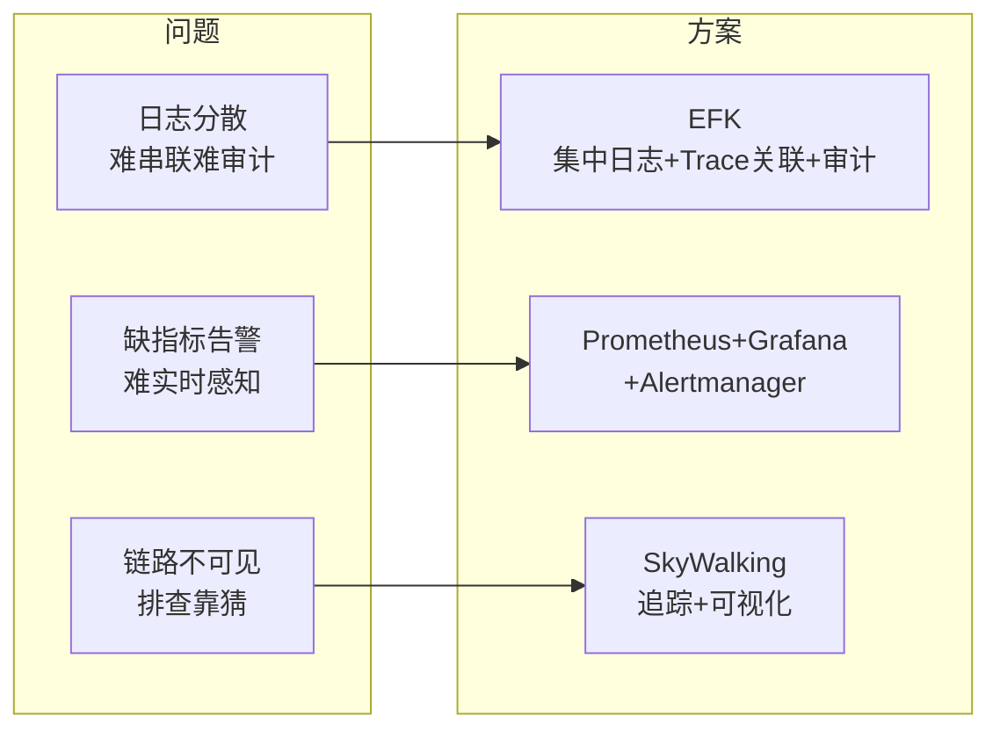

# 航空运营智能管理平台 · 可观测性案例：问题、方案与成效

> 结合[产品需求设计文档](./产品需求设计文档-航空运营智能管理平台可观测性)与[架构技术设计方案](./架构技术设计方案-航空运营智能管理平台可观测性)，按「业务存在问题 → 技术解决方案 → 最终成效」整理的案例文档，便于答辩与汇报。

---

## 文档信息

| 项目 | 说明 |
|------|------|
| 文档类型 | 案例文档（问题-方案-成效） |
| 关联文档 | [产品需求设计文档](./产品需求设计文档-航空运营智能管理平台可观测性)、[架构技术设计方案](./架构技术设计方案-航空运营智能管理平台可观测性) |

---

## 一、业务存在问题

### 1.1 场景与背景

航空运营智能管理平台采用云原生微服务架构，覆盖票务、数据同步、航班校验、旅客核验、通知推送、检修预警等多模块联动；面向全部航线、近百基地、数千万常旅客，年服务超 3000 万旅客。节假日日均数十万用户集中票务，突发航班变动时访问激增，日均处理约 800GB 实时数据。在此背景下，运维、开发、运营与合规侧暴露出以下**可观测性**相关问题。

### 1.2 问题一：日志分散，跨服务故障难以快速串联与审计

| 维度 | 具体表现 |
|------|----------|
| **现象** | 日志分散在各节点与容器内，故障发生时需逐节点、逐容器查日志，难以快速串联单次请求的完整路径。 |
| **影响** | 跨多服务的故障定位耗时长（实践中曾达约 60 分钟），影响恢复时间与业务连续性。 |
| **合规** | 票务交易、数据修改、权限变更等关键操作需满足审计与民航合规要求，分散式日志无法统一检索与长期保留。 |

### 1.3 问题二：缺乏多层次实时指标与告警，无法提前感知异常

| 维度 | 具体表现 |
|------|----------|
| **现象** | 缺乏统一、分层的指标体系：基础设施（CPU/内存/磁盘/容器）、服务（QPS/延迟/错误率）、业务（票务量/订单成功率/流式延迟）未形成一体化监控。 |
| **影响** | 压力攀升或异常出现时无法及时发现问题并触发处置，难以保障核心业务响应时间 ≤1s、峰值 ≥5000 TPS、可用性 ≥99.99% 等目标。 |
| **运维** | 7×24 稳定运行与快速响应依赖人工巡检，告警不及时、不分组，难以按严重级别与业务模块分级处理。 |

### 1.4 问题三：链路复杂，单次请求完整调用链难以还原，排查靠「猜」

| 维度 | 具体表现 |
|------|----------|
| **现象** | 单次购票等请求会经过票务、数据服务、航空信息、旅客管理、通知、检修等多模块多次调用，传统依赖日志与单点监控无法还原完整调用树。 |
| **影响** | 无法精确定位延迟或异常发生在哪一环节，性能瓶颈分析与故障溯源能力不足，排查方式以「猜测式排查」为主，效率低。 |
| **开发** | 联调与性能分析缺少按 Trace、服务、接口维度的统一视图，问题复现与下钻困难。 |

### 1.5 问题小结

| 问题 | 核心痛点 | 主要干系人 |
|------|----------|------------|
| 日志分散 | 跨服务难串联、审计难满足 | 运维、安全/合规 |
| 缺指标告警 | 无法实时感知、无法提前处置 | 运维、运营/调度 |
| 链路不可见 | 调用链难还原、排查靠猜 | 运维、开发 |

---

## 二、技术解决方案

围绕**日志（Logging）、指标（Metrics）、追踪（Tracing）**三大支柱，结合需求与架构文档，落地以下技术方案。

### 2.1 针对「日志分散、难串联、难审计」的解决方案

| 方案要点 | 技术实现 | 对应需求 |
|----------|----------|----------|
| **集中采集** | Fluentd 以 DaemonSet 部署于各节点，统一采集应用日志、访问日志、审计日志（容器 stdout/stderr 及挂载文件），无分散落盘依赖。 | L-01 |
| **结构化与 Trace 关联** | Fluentd 解析、标准化日志格式，提取或注入 Trace ID、Span ID，写入 Elasticsearch 与分布式追踪体系关联。 | L-02 |
| **检索与可视化** | Elasticsearch 按时间与业务维度建索引；Kibana 配置 Index Pattern、Saved Search、Dashboard，支持按请求 ID、服务名、时间范围、Trace ID 检索。 | L-03, L-04 |
| **审计合规** | 票务、数据修改、权限变更等审计日志在 Fluentd 中路由到独立索引，ES 配置 ILM 保留 ≥1 年，满足民航合规与安全审计。 | L-05 |

**技术栈**：EFK（Fluentd → Elasticsearch → Kibana）。采集与业务解耦，ES 多节点高可用，审计索引单独保留策略。

### 2.2 针对「缺多层次指标与告警」的解决方案

| 方案要点 | 技术实现 | 对应需求 |
|----------|----------|----------|
| **基础设施层** | Node Exporter、cAdvisor 采集主机与容器 CPU、内存、磁盘、网络；Prometheus 拉取并存储。 | M-01 |
| **服务层** | 各微服务暴露 Prometheus `/metrics`（QPS、延迟分位数、错误率、线程池/连接池）；Prometheus 配置 SLO 告警规则（如响应时间 >1s、错误率超阈值）。 | M-02, M-03 |
| **业务层** | 业务自定义 Counter/Gauge（票务交易量、订单成功率、实时接入量、流式延迟、设备异常告警数等）；Grafana 配置业务大盘与实时看板。 | M-04, M-05 |
| **告警与通知** | Alertmanager 按严重级别、业务模块分组与抑制，对接企业钉钉/企业微信/邮件等，实现 7×24 告警与快速响应。 | M-06 |

**技术栈**：Prometheus + Grafana + Alertmanager。拉取不占用业务主路径，Prometheus/Alertmanager 可多副本或集群保证高可用。

### 2.3 针对「链路不可见、排查靠猜」的解决方案

| 方案要点 | 技术实现 | 对应需求 |
|----------|----------|----------|
| **自动埋点** | SkyWalking Agent 以 Java Agent 或 sidecar 方式部署，对 HTTP、RPC、Kafka、JDBC 等自动插桩，无需业务手写埋点即可生成 Span。 | T-01 |
| **全链路 Trace** | Agent 为每个请求生成全链路唯一 Trace ID，跨进程透传，形成完整调用树。 | T-02 |
| **聚合与存储** | SkyWalking OAP 接收、聚合 Span，生成服务拓扑与依赖关系，写入 ES 或 DB，支持按 Trace/服务/接口/时间查询。 | T-03 |
| **可视化与下钻** | SkyWalking UI 展示单次请求完整调用链、各节点耗时与异常，支持慢请求与错误请求筛选与下钻；业务日志打印 Trace ID，Kibana 可按 Trace ID 与链路联动，实现「链路驱动分析」。 | T-04, T-05 |

**技术栈**：Apache SkyWalking（Agent + OAP + UI）。与日志通过统一 Trace ID 关联，故障排查从「猜」转为「看链路」。

### 2.4 方案总览

---

## 三、最终成效

### 3.1 运维与故障定位

| 指标 | 建设前 | 建设后 | 说明 |
|------|--------|--------|------|
| 跨多服务故障定位时间 | 约 60 分钟 | **≤ 5 分钟** | 集中日志 + Trace ID 关联 + 分布式追踪，从「猜测式排查」转为「链路驱动分析」。 |
| 7×24 监控与告警 | 依赖人工巡检 | **实时告警 + 分级通知** | 多层次指标与 Alertmanager 对接企业渠道，异常提前发现、快速响应。 |

### 3.2 业务与性能

| 指标 | 目标/成效 | 说明 |
|------|-----------|------|
| 核心业务响应时间 | **≤ 800ms**（目标 ≤1s） | 可观测采集与传输不占用业务主路径，且便于发现性能瓶颈并优化。 |
| 峰值处理能力 | **5500+ TPS**（目标 ≥5000 TPS） | 指标与追踪支撑容量规划与扩容决策。 |
| 系统可用性 | **99.993%**（目标 ≥99.99%） | 实时健康状态与告警保障高可用。 |

### 3.3 运营与体验

| 指标 | 成效 | 说明 |
|------|------|------|
| 日均票务处理量 | 超 12 万笔 | 系统稳定支撑业务规模。 |
| 运营效率 | 提升约 35% | 业务大盘与实时看板支撑运营与调度决策。 |
| 旅客投诉率 | 下降约 40% | 故障快速定位与修复、体验优化。 |

### 3.4 合规与安全

| 指标 | 成效 | 说明 |
|------|------|------|
| 审计日志保留 | **≥ 1 年** | 票务、权限等关键操作可追溯，满足民航合规与安全审计。 |
| 设备故障预警准确率 | 约 92% | 业务层指标与告警支撑检修与预警。 |

### 3.5 成效小结

- **故障定位**：60 分钟 → 5 分钟内，链路驱动分析。
- **业务指标**：响应 ≤800ms，峰值 5500+ TPS，可用性 99.993%。
- **审计合规**：关键操作审计日志保留 ≥1 年。
- **运维方式**：7×24 实时监控与告警，从「猜测式排查」转为「链路驱动分析」。

系统于 2025 年 8 月正式上线，截至 2026 年 5 月已稳定运行约 10 个月，各项功能及性能指标均达到或超过预设标准，获得客户与用户认可。

---

## 附录：问题-方案-成效对照表

| 业务问题 | 技术解决方案 | 最终成效 |
|----------|--------------|----------|
| 日志分散，跨服务难串联、审计难满足 | EFK 集中采集 + 结构化 + Trace 关联 + 审计索引保留 ≥1 年 | 故障定位 ≤5 分钟；审计可追溯、合规达标 |
| 缺多层次指标与告警，无法实时感知 | Prometheus+Grafana+Alertmanager，基础设施/服务/业务三层指标与 SLO 告警 | 7×24 告警与快速响应；可用性 99.993%，峰值 5500+ TPS |
| 链路不可见，单次请求难还原，排查靠猜 | SkyWalking Agent+OAP+UI，自动埋点与 Trace 透传；与日志按 Trace ID 联动 | 链路驱动分析；慢/错请求可筛选下钻，运维与开发效率提升 |

---

*本案例文档基于[产品需求设计文档](./产品需求设计文档-航空运营智能管理平台可观测性)与[架构技术设计方案](./架构技术设计方案-航空运营智能管理平台可观测性)整理，用于答辩、汇报与案例题备考。*
