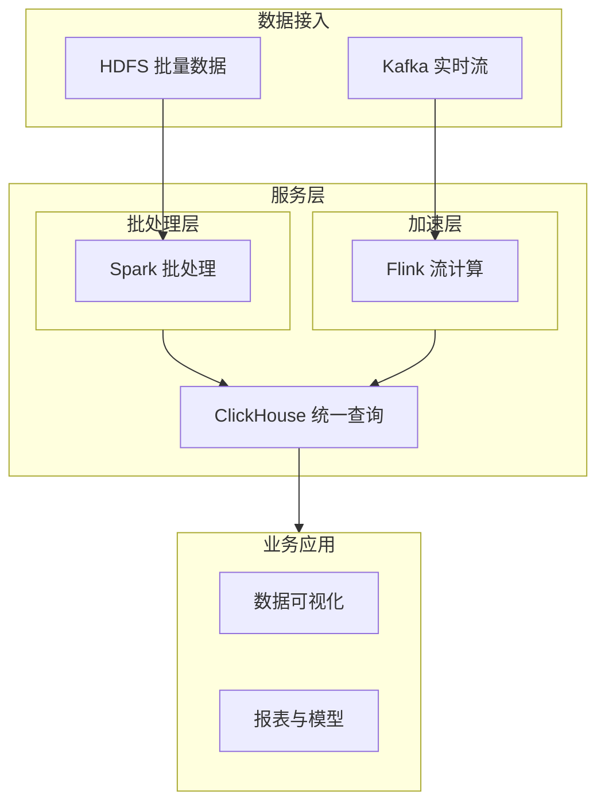

## 1.摘要（字数要求严格限制300字）
2024年3月，我参与某航空公司运营智能管理平台建设，项目面向航空运营机构、机场、旅客等用户，提供航空信息管理、旅客全流程服务、票务交易、航空检修预警、数据智能分析等核心业务功能。项目中，我担任系统架构师，全面负责平台架构设计与核心技术落地。本文围绕大数据 Lambda 架构在航空运营场景中的应用展开论述，通过批处理层构建精准航空数据底座支撑深度分析与模型训练，基于加速层实现实时数据处理与秒级监测预警，结合服务层统一数据查询入口保障业务应用高可用。系统于2025年8月正式上线，截至2026年5月已稳定运行10个月，各项功能及性能指标均达到预设标准，获得客户高度认可。

## 2.项目背景（字数要求严格限制500字左右）
随着国家智慧民航建设战略深入推进，航空运输行业数字化、智能化转型迫在眉睫，《智慧民航建设路线图》等政策明确要求推动航空运营全流程数字化、智能化升级。在此背景下，某航空公司于2024年5月启动航空运营智能管理平台建设，旨在构建覆盖全部航线网络、近百个运营基地及数千万常旅客的数字化管理平台，实现航线、航班、票务等核心业务全流程智能管控，同时为每年超3000万旅客提供全场景便捷服务，提升运营效率与服务体验。

我司中标后，我以系统架构师身份负责平台整体架构设计与核心技术落地。平台面临突出业务挑战：节假日高峰日均数十万用户集中办理票务，突发航班变动时访问量激增，且需日均处理800GB实时数据、年度累计处理10PB+离线数据，对资源弹性调度、数据处理效率及系统稳定性、安全性提出极高要求。业务数据同时包含历史批量与实时流式，既要支撑 T+1 报表与模型训练，又要支撑秒级监测与告警，因此我们选用 Lambda 架构作为数据处理核心，通过批处理层、加速层与服务层协同，保障数据一致性、完整性与实时性。

为此，我们团队决定基于大数据 Lambda 架构，采用 HDFS、Spark、Kafka、Flink 及统一服务层存储与查询引擎，构建批流一体、统一查询的数据体系。平台于2025年8月正式上线，成功应对多轮节假日高并发压力，高效完成年度航班调度、设备检修预警及海量数据处理任务，为旅客提供全流程服务与7*24小时信息支持，上线一年稳定运行，各项指标达标，获得客户与用户一致认可。

## 3. 问题2回应+过度（字数要求严格限制400字）
由于本项目同时面临海量历史数据离线分析与实时数据秒级处理需求，若仅依赖 T+1 批处理无法满足实时监测与预警，若仅依赖流处理又难以保障全量历史数据的准确性与模型训练所需的高质量数据底座。因此我们选用 Lambda 架构作为大数据处理核心，其核心包括：第一，批处理层基于 HDFS 与 Spark 处理海量历史数据，完成清洗、转换与特征工程，构建精准航空数据底座，支撑深度分析与 AI 模型训练；第二，加速层基于 Kafka 与 Flink 实现实时数据处理，满足秒级监测与预警需求，为新事件提供快速响应；第三，服务层合并批处理与加速层产出的视图，提供统一、一致的数据查询入口，保障业务应用高可用与查询效率。

在本项目的实施中，我们通过批处理层、加速层与服务层三大实践，完成了 Lambda 架构在航空运营智能管理平台中的建设与落地，具体如下。

## 4. 正文部分三段论

### 正文三论点总览表

| 论点 | 要解决的问题 | 方案 / 技术栈 | 核心成效 |
|------|--------------|----------------|----------|
| **论点一：批处理层构建精准航空数据底座** | T+1 分析滞后、AI 模型缺乏高质量历史数据 | HDFS 存储、Spark on YARN 批处理，汇聚 IoT、业务、航班等数据，清洗、转换与特征工程 | 日报处理从数小时降至约 24 分钟，为模型训练提供高质量数据，数据准确性与完整性保障 |
| **论点二：加速层实现实时数据处理与秒级预警** | 实时反馈与异常告警需求 | Kafka 接入、Flink 流式计算，滑动窗口与业务规则，设备状态视图与告警列表 | 秒级监测与预警，实时处理延迟从分钟级降至秒级，异常识别准确率≥98% |
| **论点三：服务层统一数据查询入口保障高可用** | 批与实时视图分离、多应用统一查询与高可用 | 统一存储与查询引擎（如 ClickHouse），合并批与实时视图，简单 API、高并发查询 | 统一一致的数据访问接口，可用性 99.9% 以上，查询响应毫秒级，业务稳定高效 |

## 批处理层：构建精准航空数据底座，支撑深度分析与模型训练（字数要求严格限制在500-510字左右）
航空运营平台年度累计历史数据达 10PB+，涵盖航线、航班、票务、旅客、检修等多维度，若仅依赖传统 T+1 批处理与单机能力，难以在合理时间内完成日报、周报及模型训练所需的全量加工，且数据质量与一致性难以保障。为此，我们构建了 Lambda 架构的批处理层。存储上，采用 HDFS 作为分布式文件存储，将来自航空信息、票务、旅客、检修及数据采集等系统的历史数据长期保存。计算上，采用 Spark on YARN 进行批处理，每日对约 800GB 增量及历史全量进行清洗、转换与聚合；针对航线需求预测、设备故障预警、旅客消费偏好等模型需求，进行特征工程（如流量异常检测、航线与地域关联等），产出高质量训练与分析数据集。通过分布式计算与资源调度，将日报等批处理任务从原先的约 8 小时缩短至约 24 分钟，T+1 数据处理成功率≥99.9%，复杂模型训练在约定时间窗口内完成。批处理层为加速层与服务层提供了准确、完整的离线视图，为深度分析与 AI 模型训练奠定了数据底座，是 Lambda 架构中保障“准确性”与“可重复计算”的核心一环。

## 加速层：实现实时数据处理，赋能秒级监测与预警（字数要求严格限制在500-510字左右）
平台需对航班动态、票务交易、设备运行与旅客操作等实时数据做秒级采集与计算，识别超售风险、设备参数异常、集中退票峰值等并即时告警，传统批处理无法满足低延迟要求。为此，我们构建了 Lambda 架构的加速层。接入上，采用 Kafka 接收各业务系统与采集端上报的实时流数据，峰值时段支持 50 万+ 并发实时数据接入。计算上，采用 Flink 进行流式计算，按业务规则（如滑动窗口、阈值与聚合）在秒级内完成处理，产出实时视图与告警事件；例如对管道压力、设备状态等指标进行秒级监测，异常时即时生成告警并推送至综合监控平台与处置模块。加速层产出的“设备运行状态视图”“当前告警列表”等与批处理层产出的历史视图在服务层合并，满足“最近状态实时、历史结果精准”的查询需求。通过加速层，实时数据采集延迟≤1 秒，流式计算处理延迟≤2 秒，实时告警推送延迟≤3 秒，秒级监测与预警能力显著提升，为运营调度、检修与客服提供了实时数据支撑，是 Lambda 架构中保障“实时性”与“快速响应”的核心一环。

## 服务层：统一数据查询入口，保障业务应用高可用（字数要求严格限制在500-510字左右）
多类业务应用（数据可视化、报表、模型服务、运营大屏）需同时访问批处理层产出的历史视图与加速层产出的实时视图，若各自直连批与流存储则接口不一、可用性与性能难以统一保障。为此，我们构建了 Lambda 架构的服务层，作为统一数据查询入口。技术上，采用支持高并发分析的存储与查询引擎（如 ClickHouse），存储批处理层与加速层产出的聚合结果与分析数据，支持复杂多维二次分析；对实时压力、航班动态等流式结果通过 Kafka 或旁路写入服务层，保证查询时能合并批与实时视图。接口上，对外提供统一、简单的查询 API，业务侧无需关心数据来自批处理还是加速层。高可用与性能上，通过多副本、缓存与内存计算支撑高并发查询，数据更新延迟≤3 秒，PB 级数据集查询响应时间≤5 秒，服务层可用性达 99.9% 以上。通过服务层，各业务应用获得一致、稳定、高效的数据访问能力，Lambda 架构的“批流融合、统一查询”得以落地，为智慧民航的精准决策与实时运营提供了可靠的数据服务基础。

## 5. 论文总结（字数要求严格限制450字以内）
本平台响应智慧民航建设政策，以大数据 Lambda 架构（批处理层、加速层、服务层）为核心，构建航空运营全流程一体化管理体系，2025年8月上线后稳定运行一年，超额达成预期目标。上线以来，系统日均处理票务交易超12万笔，核心业务响应时间≤800毫秒，运营效率提升35%，旅客投诉率下降40%，设备故障预警准确率92%，系统可用性达99.993%，峰值处理能力突破5500 TPS，成功应对节假日高并发压力，获行业与旅客广泛认可。Lambda 架构保障了核心业务数据准确性、实时处理延迟从分钟级降至秒级、查询响应达毫秒级，设备故障率与用户投诉显著下降。项目复盘发现，批处理与历史数据处理仍有优化空间。后续将引入批流一体架构（如 Flink 统一计算引擎）与更先进的数据存储与索引技术，探索 Lambda 与数据湖（Lakehouse）、AI 数据治理的融合，助力智慧民航高质量发展。

## 6. 系统架构图

**图 1-1** 航空运营智能管理平台·Lambda 架构应用图
