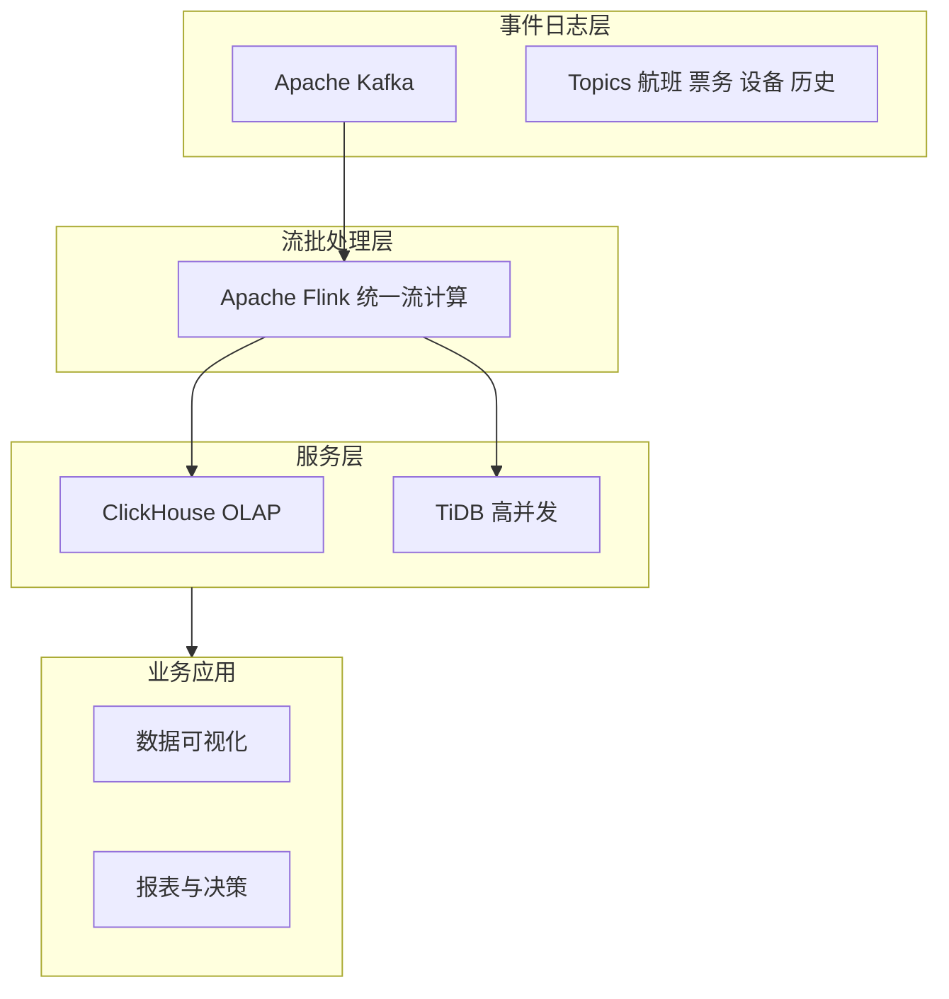

## 1.摘要（字数要求严格限制300字）
2024年3月，我参与某航空公司运营智能管理平台建设，项目面向航空运营机构、机场、旅客等用户，提供航空信息管理、旅客全流程服务、票务交易、航空检修预警、数据智能分析等核心业务功能。项目中，我担任系统架构师，全面负责平台架构设计与核心技术落地。本文围绕大数据 Kappa 架构在航空运营场景中的应用展开论述，通过事件日志层构建可靠数据基石并统一实时与历史数据源，基于统一流计算引擎实现全场景流批一体处理，结合服务层混合引擎支撑高并发与复杂分析、赋能实时决策。系统于2025年8月正式上线，截至2026年5月已稳定运行10个月，各项功能及性能指标均达到预设标准，获得客户高度认可。

## 2.项目背景（字数要求严格限制500字左右）
随着国家智慧民航建设战略深入推进，航空运输行业数字化、智能化转型迫在眉睫，《智慧民航建设路线图》等政策明确要求推动航空运营全流程数字化、智能化升级。在此背景下，某航空公司于2024年5月启动航空运营智能管理平台建设，旨在构建覆盖全部航线网络、近百个运营基地及数千万常旅客会员的数字化管理平台，实现航线、航班、票务等核心业务全流程智能管控，年服务旅客超3000万人次，为其提供全场景便捷服务，提升运营效率与服务体验。

我司中标后，我以系统架构师身份负责平台整体架构设计与核心技术落地。平台面临突出业务挑战：节假日高峰日均数十万用户集中办理票务，突发航班变动时访问量激增，且需日均处理800GB实时数据、年度累计处理10PB+离线数据，对资源弹性调度、数据处理效率及系统稳定性、安全性提出极高要求。传统 Lambda 架构批流分离、两套逻辑维护成本高且易出现实时与历史数据不一致，因此我们选用 Kappa 架构，以“一切皆流”为理念，通过统一事件日志与流计算引擎实现实时与历史的一体处理，提升一致性、简化架构并支持历史数据重放。

为此，我们团队决定基于大数据 Kappa 架构，采用 Apache Kafka 事件日志、Apache Flink 统一流计算及 ClickHouse 与 TiDB 混合服务层，构建实时与历史统一的大数据处理平台。平台于2025年8月正式上线，成功应对多轮节假日高并发压力，高效完成年度航班调度、设备检修预警及海量数据处理任务，为旅客提供全流程服务与7*24小时信息支持，上线一年稳定运行，各项指标达标，获得客户与用户一致认可。

## 3. 问题2回应+过度（字数要求严格限制400字）
由于本项目需同时满足实时分析与历史重算需求，若批处理与流处理分离维护则逻辑双份、数据口径易不一致，且历史数据重放与回溯能力不足。因此我们选用 Kappa 架构，其核心为“一切皆流”、单一流处理通道统一处理。其核心包括：第一，事件日志层以 Apache Kafka 作为可靠、持久化的分布式消息队列，统一接入实时与历史数据源，通过 Topic 与 offset 机制支持历史数据重消费与回溯；第二，流批处理层（实时层）以 Apache Flink 为统一流计算引擎，凭借有状态计算与精确一次语义，实现全场景实时与准实时处理，Kafka 分区与 Flink 检查点保障数据完整性；第三，服务层采用混合引擎（ClickHouse 高性能 OLAP 与 TiDB 高并发读写），支撑高并发查询与复杂分析，赋能实时决策并保障高可用。

在本项目的实施中，我们通过事件日志层、流批处理层与服务层三大实践，完成了 Kappa 架构在航空运营智能管理平台中的建设与落地，具体如下。

## 4. 正文部分三段论

### 正文三论点总览表

| 论点 | 要解决的问题 | 方案 / 技术栈 | 核心成效 |
|------|--------------|----------------|----------|
| **论点一：事件日志层构建可靠数据基石** | 数据来源多样、实时与历史口径不一致 | Apache Kafka 为中心事件日志，多 Topic 接入航班/票务/设备/历史数据，Kafka Connect 持久化，offset 支持重放 | 统一数据入口，支持历史重放与回溯，解决实时与历史不一致 |
| **论点二：流批处理层统一流计算引擎** | 批与流分离、双套逻辑维护难 | Apache Flink 统一流计算，有状态、精确一次语义，Kafka 分区+Flink 检查点保障完整性 | 数据处理效率提升约 40%，全场景实时与准实时处理 |
| **论点三：服务层混合引擎支撑高并发与复杂分析** | 应用需快速消费结果、高并发与复杂分析并存 | ClickHouse 高性能 OLAP 与结果存储，TiDB 高并发写入与查询，混合引擎 | 高并发与复杂分析兼顾，数据一致性与可用性 99.99% |

## 事件日志层：构建可靠数据基石，统一实时与历史数据源（字数要求严格限制在500-510字左右）
航空运营平台数据来源多样，包括航班动态、票务交易、设备运行、旅客操作等实时流，以及历史归档与外部系统数据，若实时与历史走不同通道、不同存储，则口径不一致且难以统一重放与回溯。为此，我们构建了 Kappa 架构的事件日志层，以 Apache Kafka 为核心。Kafka 作为可靠、持久化的分布式消息队列，将所有系统产生的数据统一接入并按业务域划分 Topic（如航班动态、票务事件、设备监测、历史补录等），实时数据持续写入，历史数据可通过批量导入或 Kafka Connect 同步进入同一套日志，实现“一切皆流”的单一数据源。持久化与回溯方面，Kafka 的日志保留与 offset 机制支持任意时刻起的历史数据重消费，便于重算、回溯与审计。通过事件日志层，实时与历史数据在统一入口下一致可追溯，为上层流批处理层提供了可靠、可重放的数据基石，解决了传统架构中实时与历史数据不一致的问题，是 Kappa 架构简化运维、保障一致性的基础。

## 流批处理层：以统一流计算引擎实现全场景数据处理（字数要求严格限制在500-510字左右）
Kappa 架构不设独立批处理层，批与流均由同一流处理引擎完成：实时任务持续运行，历史或回溯任务通过从事件日志重放数据并经过同一套计算逻辑实现。为此，我们采用 Apache Flink 作为统一流计算引擎。Flink 具备有状态计算与精确一次（exactly-once）语义，配合 Kafka 分区与 Flink 检查点机制，保证在故障恢复与回溯重算时数据不丢不重。业务上，Flink 承担实时监测、实时聚合、准实时报表及历史重算等全场景任务：对航班动态、票务、设备等流数据进行秒级窗口聚合与规则计算，产出实时指标与告警；对需要 T+1 或历史回溯的指标，通过从 Kafka 指定 offset 重放并运行同一套作业逻辑完成。通过统一引擎，我们避免了 Lambda 架构下批流两套代码与两套口径的维护成本，数据处理效率提升约 40%，实时与历史结果一致可验证，全场景数据处理在 Kappa 架构下得以统一、高效落地。

## 服务层：采用混合引擎支撑高并发与复杂分析，赋能实时决策（字数要求严格限制在500-510字左右）
流批处理层产出的结果需被数据可视化、报表、模型服务与运营大屏等应用快速消费，既要支撑高并发点查与大屏刷新，又要支撑多维度复杂分析即席查询。单一存储引擎难以同时优化“高并发写入与点查”与“复杂 OLAP”。为此，我们构建了 Kappa 架构的服务层，采用混合引擎。对聚合结果、指标与分析型数据，采用 ClickHouse 作为高性能 OLAP 引擎存储与查询，支持多维度筛选、聚合与复杂分析，PB 级数据集查询响应时间控制在秒级。对实时写入密集、高并发读写的业务表（如实时状态、会话等），采用 TiDB 等分布式数据库，保障高并发写入与低延迟查询。服务层对外提供统一查询接口或数据服务，业务应用无需关心底层是 ClickHouse 还是 TiDB。通过混合引擎，服务层在保证高数据一致性与 99.99% 可用性的前提下，兼顾了高并发与复杂分析，实时分析延迟控制在 5 秒以内，为智慧民航的实时决策与运营分析提供了稳定、高效的数据服务能力。

## 5. 论文总结（字数要求严格限制450字以内）
本平台响应智慧民航建设政策，以大数据 Kappa 架构（事件日志层、流批处理层、服务层）为核心，构建航空运营全流程一体化管理体系，2025年8月上线后稳定运行一年，超额达成预期目标。上线以来，系统日均处理票务交易超12万笔，核心业务响应时间≤800毫秒，运营效率提升35%，旅客投诉率下降40%，设备故障预警准确率92%，系统可用性达99.993%，峰值处理能力突破5500 TPS，成功应对节假日高并发压力，获行业与旅客广泛认可。Kappa 架构实现了实时分析延迟≤5 秒、数据处理效率提升约 40%、数据可用性 99.99%，业务覆盖与决策时效显著提升。项目复盘发现，可进一步探索流处理架构与 AI/ML 的融合，实现更智能、可扩展的数字航空运营体系，助力智慧民航高质量发展。

## 6. 系统架构图

**图 2-1** 航空运营智能管理平台·Kappa架构应用 架构图
