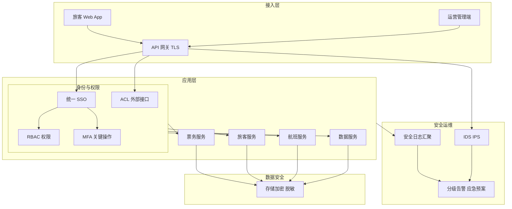

## 1.摘要（字数要求严格限制300字）
2024年3月，我参与某航空公司运营智能管理平台建设，项目面向航空运营机构、机场、旅客等用户，提供航空信息管理、旅客全流程服务、票务交易、航空检修预警、数据智能分析等核心业务功能。项目中，我担任系统架构师，全面负责平台架构设计与核心技术落地。本文围绕安全架构设计在航空运营场景中的应用展开论述，通过身份认证与权限管控体系落地防范越权与误操作风险，基于数据全生命周期安全防护保障旅客敏感信息不泄露，结合威胁检测与应急响应机制抵御外部攻击与异常行为。系统于2025年8月正式上线，截至2026年5月已稳定运行10个月，各项功能及性能指标均达到预设标准，获得客户高度认可。

## 2.项目背景（字数要求严格限制500字左右）
随着国家智慧民航建设战略深入推进，航空运输行业数字化、智能化转型迫在眉睫，《智慧民航建设路线图》等政策明确要求推动航空运营全流程数字化、智能化升级。在此背景下，某航空公司于2024年5月启动航空运营智能管理平台建设，旨在构建覆盖全部航线网络、近百个运营基地及数千万常旅客的数字化管理平台，实现航线、航班、票务等核心业务全流程智能管控，同时为每年超3000万旅客提供全场景便捷服务，提升运营效率与服务体验。

我司中标后，我以系统架构师身份负责平台整体架构设计与核心技术落地。平台面临突出业务挑战：节假日高峰日均数十万用户集中办理票务，突发航班变动时访问量激增，且需日均处理800GB实时数据、年度累计处理10PB+离线数据，对资源弹性调度、数据处理效率及系统稳定性、安全性提出极高要求。平台承载旅客身份、票务交易、航班与检修等敏感数据，多角色（旅客、运营、运维、合作方）接入，系统间交互复杂，面临越权与误操作、数据泄露、网络攻击与入侵等风险，必须在架构层面落实“分层防护、全生命周期管理、动态防御”的安全设计。

为此，我们团队决定系统化开展安全架构设计，从身份认证与权限管控、数据全生命周期防护、威胁检测与应急响应三方面构建端到端安全体系，保障用户操作与系统交互的可控、可审计与可恢复。平台于2025年8月正式上线，成功应对多轮节假日高并发压力，高效完成年度航班调度、设备检修预警及海量数据处理任务，为旅客提供全流程服务与7*24小时信息支持，上线一年稳定运行，各项指标达标，获得客户与用户一致认可。

## 3. 问题2回应+过度（字数要求严格限制400字）
由于本项目涉及旅客身份、票务与资金等敏感数据，多角色、多子系统接入，若缺乏统一身份与细粒度权限管控，易出现越权访问与误操作；同时数据在传输、存储、使用与归档各环节若未加密与脱敏，存在泄露与合规风险；此外，面对 DDoS、入侵与异常行为，若缺乏实时检测与分级应急机制，难以快速响应与恢复。因此我们选用以“身份认证与权限管理”“数据全生命周期安全”“威胁检测与应急响应”为核心的安全架构设计，其核心包括：第一，身份认证与权限管控体系落地，通过统一 SSO、RBAC 细粒度权限与 ACL、多因素认证（MFA）等，防范越权与误操作风险；第二，数据全生命周期安全防护，通过传输加密（TLS）、存储加密与脱敏、分类与审计，保障敏感信息不泄露；第三，威胁检测与应急响应机制构建，通过安全日志汇聚、IDS/IPS、告警与分级应急预案，抵御外部攻击并实现快速响应。

在本项目的实施中，我们通过身份认证与权限管控、数据全生命周期安全防护、以及威胁检测与应急响应三大实践，完成了安全架构设计在航空运营智能管理平台中的建设与落地，具体如下。

## 4. 正文部分三段论

### 正文三论点总览表

| 论点 | 要解决的问题 | 方案 / 技术栈 | 核心成效 |
|------|--------------|----------------|----------|
| **论点一：身份认证与权限管控体系落地** | 多系统多角色下认证分散、权限粗放，易越权与误操作，难以审计 | 统一 SSO、内部应用 RBAC 细粒度权限与角色审批、外部应用 ACL、关键操作 MFA；安全审计平台监控用户行为 | 子系统 100% 接入 SSO，越权与误操作显著下降，行为可追溯，满足民航权限与审计要求 |
| **论点二：数据全生命周期安全防护** | 旅客身份证号、银行卡号等敏感数据在传输、存储、使用环节存在泄露与合规风险 | 传输 TLS 1.3、存储 AES-256 加密与备份加密、动态脱敏与数据分类、安全监控与审计、漏洞扫描与 AI 异常行为检测 | 敏感数据 100% 加密保护，未发生敏感信息泄露事件，符合数据隐私与民航合规要求 |
| **论点三：威胁检测与应急响应机制构建** | 恶意入侵、DDoS、异常登录与高频查询等缺乏实时检测与分级响应 | 全量操作与访问日志汇聚至安全监控平台；IDS/IPS；异常登录与高频查询等分级告警；一级（如 DDoS）5 分钟响应、二级 2 小时内恢复等应急预案 | 安全事件平均响应时间≤30 分钟，安全可用性 99.999%，重大安全事件零发生 |

## 身份认证与权限管控体系落地，防范越权与误操作风险（字数要求严格限制在500-510字左右）
航空运营平台面向旅客、运营人员、运维人员及合作方等多类用户，子系统涵盖票务、旅客、航班、检修、数据服务与辅助管理等，若各系统独立认证、权限按模块粗放分配，易出现越权访问、误操作与行为难以追溯等问题。为此，我们建立了统一的身份认证与权限管控体系。认证层面，建设统一 SSO，各子系统 100% 接入，用户一次登录即可访问其权限范围内的多系统，避免多套账号与弱口令；对管理端与敏感操作引入多因素认证（MFA），降低账号盗用与暴力破解风险。权限层面，内部运营与运维应用采用 RBAC 模型，按角色分配菜单、接口与数据范围，支持角色自定义与权限申请审批流程，实现细粒度控制；对外部合作方与开放接口采用 ACL 与白名单机制，仅开放必要接口与数据。审计层面，建设安全审计平台，对登录、关键业务操作（票务交易、数据修改、权限变更等）进行记录与监控，可检测异地登录、暴力破解、异常操作等风险行为并触发告警，日志保留≥1 年，支持追溯查询。通过上述设计，越权与误操作事件显著下降，行为可追溯可审计，满足了民航对权限管控与操作合规的要求，为数据与业务安全提供了身份与访问控制基础。

## 数据全生命周期安全防护，保障敏感信息不泄露（字数要求严格限制在500-510字左右）
平台处理旅客身份证号、银行卡号、行程与票务等敏感数据，在传输、存储、使用与归档各环节若未加密或未脱敏，存在泄露与合规风险。为此，我们实施了数据全生命周期安全防护。传输环节，全站采用 TLS 1.3 加密，确保数据在网络上不以明文传输。存储环节，旅客敏感字段采用 AES-256 等方式加密存储，备份数据同样加密，避免备份介质泄露导致批量泄露。使用环节，对非业务必需的敏感字段在展示与导出时进行动态脱敏，并依据数据分类策略对不同级别数据实施差异化访问控制与审计。同时，建立安全监控与审计能力，对敏感数据的访问与导出进行日志记录与异常检测；定期开展漏洞扫描与安全审计，防范 SQL 注入、XSS 等漏洞；引入基于 AI 的异常行为检测，对异常登录、高频查询、批量导出等行为进行识别与分级告警，实现事前发现与快速处置。通过上述设计，敏感数据 100% 纳入加密与脱敏策略，上线以来未发生敏感信息泄露事件，符合数据隐私法规与民航对旅客信息保护的要求，有效保障了旅客与企业的数据安全。

## 威胁检测与应急响应机制构建，抵御外部安全攻击（字数要求严格限制在500-510字左右）
平台对外提供 Web 与移动端服务，面临 DDoS、恶意入侵、撞库与异常爬取等风险，若缺乏实时检测与分级应急能力，难以快速发现、遏制与恢复。为此，我们构建了威胁检测与应急响应机制。检测层面，将各子系统的操作日志、设备日志与访问日志统一汇聚至安全监控平台，结合 IDS/IPS 对网络流量进行实时分析，识别恶意入侵与攻击特征；对异常登录、异地登录、高频查询与批量异常请求等行为设置规则与 AI 模型，触发分级告警。响应层面，制定分级应急预案：一级事件（如 DDoS、核心系统入侵）要求 5 分钟内启动响应与处置，二级事件（如单点异常、可疑行为）要求 2 小时内完成排查与恢复；告警信息接入值班与工单系统，确保 7×24 小时有人跟进。云原生部署环境下，结合 Kubernetes 与网关的限流、封禁与弹性扩容能力，有效抵御 DDoS 与突发流量冲击。通过上述设计，安全事件平均响应时间控制在 30 分钟以内，安全可用性达 99.999%，DDoS 等重大攻击均被有效防护，未发生重大安全事件，满足了智慧民航对安全稳定运行与快速恢复的要求。

## 5. 论文总结（字数要求严格限制450字以内）
本平台响应智慧民航建设政策，以安全架构设计（身份认证与权限管控、数据全生命周期安全防护、威胁检测与应急响应）为核心，构建航空运营全流程一体化管理体系，2025年8月上线后稳定运行一年，超额达成预期目标。上线以来，系统日均处理票务交易超12万笔，核心业务响应时间≤800毫秒，运营效率提升35%，旅客投诉率下降40%，设备故障预警准确率92%，系统可用性达99.993%，峰值处理能力突破5500 TPS，成功应对节假日高并发压力，获行业与旅客广泛认可。安全方面，实现子系统 100% SSO、敏感数据 100% 加密保护，安全事件发现与处置效率显著提升，越权与误操作下降，未发生重大安全事件。项目复盘发现仍有优化空间：一是复杂场景下检测规则与误报率需持续调优；二是多域与多云环境下 DDoS 与威胁情报联动可进一步强化。后续将推进策略自动更新与动态防御、多域 DDoS 防护（IDIP）及告警管理优化，持续探索 AI 安全运维与 DevSecOps，助力智慧民航安全高质量发展。

## 6. 系统架构图

**图 1-1** 航空运营智能管理平台·安全架构设计图
