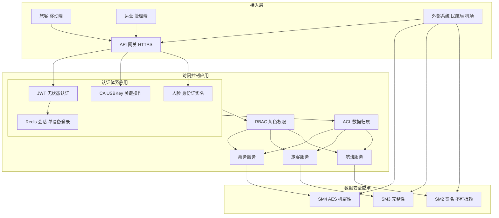

## 1.摘要（字数要求严格限制300字）
2024年3月，我参与某航空公司运营智能管理平台建设，项目面向航空运营机构、机场、旅客等用户，提供航空信息管理、旅客全流程服务、票务交易、航空检修预警、数据智能分析等核心业务功能。项目中，我担任系统架构师，全面负责平台架构设计与核心技术落地。本文围绕安全架构应用在航空运营场景中的落地展开论述，通过认证体系应用（JWT 与多因素认证、CA 证书与实名核验）保障身份可信，基于 RBAC 与 ACL 融合的访问控制应用实现细粒度权限与数据归属管控，结合数据安全应用（机密性、完整性、不可抵赖）保障与外部系统对接及敏感数据交换安全。系统于2025年8月正式上线，截至2026年5月已稳定运行10个月，各项功能及性能指标均达到预设标准，获得客户高度认可。

## 2.项目背景（字数要求严格限制500字左右）
随着国家智慧民航建设战略深入推进，航空运输行业数字化、智能化转型迫在眉睫，《智慧民航建设路线图》等政策明确要求推动航空运营全流程数字化、智能化升级。在此背景下，某航空公司于2024年5月启动航空运营智能管理平台建设，旨在构建覆盖全部航线网络、近百个运营基地及数千万常旅客的数字化管理平台，实现航线、航班、票务等核心业务全流程智能管控，同时为每年超3000万旅客提供全场景便捷服务，提升运营效率与服务体验。

我司中标后，我以系统架构师身份负责平台整体架构设计与核心技术落地。平台面临突出业务挑战：节假日高峰日均数十万用户集中办理票务，突发航班变动时访问量激增，且需日均处理800GB实时数据、年度累计处理10PB+离线数据，对资源弹性调度、数据处理效率及系统稳定性、安全性提出极高要求。平台需兼容互联网、政务外网及多终端访问，并对接民航局、机场等多级系统进行数据交换，大规模、高并发的业务与多端多角色接入使身份可信、权限可控与数据交换安全成为核心任务，必须在应用层系统化落地认证、访问控制与数据安全机制。

为此，我们团队决定在安全架构设计基础上，重点推进安全架构应用落地，依据 GB/T 9387.2 等标准中的认证服务、访问控制与数据安全保障要求，构建 JWT 与多因素认证及 CA 证书应用、RBAC 与 ACL 融合的访问控制应用、以及面向机密性完整性不可抵赖的数据安全应用。平台于2025年8月正式上线，成功应对多轮节假日高并发压力，高效完成年度航班调度、设备检修预警及海量数据处理任务，为旅客提供全流程服务与7*24小时信息支持，上线一年稳定运行，各项指标达标，获得客户与用户一致认可。

## 3. 问题2回应+过度（字数要求严格限制400字）
由于本项目多终端、多角色接入且与多级外部系统对接，若认证方式分散、权限粗放、数据交换无加密与签名，则身份冒用、越权访问与数据篡改抵赖风险高。因此我们以 GB/T 9387.2 等标准中的认证服务、访问控制与数据安全保障为设计依据，在应用层落地安全架构，其核心包括：第一，认证体系应用，通过 JWT 无状态认证与 Redis 会话缓存支撑高并发登录，结合单设备登录、CA 证书（如 USBKey）保障关键资金与审批操作，以及移动端人脸与身份证实名核验增强身份可信；第二，访问控制应用，通过 RBAC 与 ACL 融合，按角色分配操作权限、按数据归属与单位属性做资源级控制，满足细粒度业务授权与防越权；第三，数据安全应用，通过加密算法保障机密性、哈希算法保障完整性、数字签名保障不可抵赖，在与民航局及机场等外部系统对接时确保数据交换安全可靠。

在本项目的实施中，我们通过认证体系应用、访问控制应用、以及数据安全应用三大落地实践，完成了安全架构应用在航空运营智能管理平台中的建设与推广，具体如下。

## 4. 正文部分三段论

### 正文三论点总览表

| 论点 | 要解决的问题 | 方案 / 技术栈 | 核心成效 |
|------|--------------|----------------|----------|
| **论点一：认证体系应用** | 高并发下会话与身份可信、关键操作防冒用、多端登录与实名合规 | JWT 无状态认证 + Redis 分布式会话（1 小时失效）；单账号单设备登录；CA/USBKey 用于合同签署与资金审批；移动端人脸+身份证实名核验 | 日均百万级安全认证稳定支撑，关键资金与审批操作可追溯可验签，满足实名与民航合规要求 |
| **论点二：访问控制应用** | 多角色多单位下权限细粒度控制与数据归属隔离，防止越权 | RBAC 按角色（审批管理员、普通用户、财务人员等）分配操作权限；ACL 按单位类型与数据归属字段限制资源访问；二者融合 | 权限管理清晰、越权访问可控，不同角色与单位仅能访问授权范围，满足多租户与多级管理需求 |
| **论点三：数据安全应用** | 与外部系统对接时传输与存储可被窃听篡改抵赖的风险 | 机密性：HTTPS + 国密 SM4/ AES 加密报文；完整性：SM3 等哈希随数据传输、接收方校验；不可抵赖：SM2 数字签名，发方私钥签名、收方公钥验签 | 对接数据机密性、完整性、不可抵赖性得到保障，未发生对接数据泄露或篡改纠纷 |

## 认证体系应用，保障身份可信与关键操作可追溯（字数要求严格限制在500-510字左右）
航空运营平台面向旅客、运营、财务、运维及合作方等多类用户，日均认证请求在高峰时达百万级，且票务与资金类操作必须可追溯、防冒用。为此，我们在应用层系统化落地认证体系。会话与高并发方面，采用 JWT 无状态认证，服务端不落库保存会话，结合 Redis 分布式缓存存储最新用户信息与令牌，设置 1 小时过期，超时无操作则需重新认证，既减轻数据库压力又满足安全时效要求，日均百万级安全认证稳定支撑。多端与防串号方面，利用 Redis 键唯一性实现单账号单设备登录，同一账号仅允许在一处登录，增强多维会话安全，降低账号共享与盗用风险。关键操作方面，对财务人员与管理人员涉及合同签署、资金划转、财务审批等操作，引入 CA 证书（如 USBKey 数字证书）进行强认证，确保操作主体可验签、不可抵赖。移动端审批与实名方面，集成移动审批能力便于外勤与领导审批；对旅客或需实名场景，引入人脸识别与身份证比对，满足民航局身份核验与实名制要求。通过上述应用，平台在高并发下保持了认证稳定与身份可信，关键资金与审批操作可追溯可验签，满足了智慧民航对身份与操作安全的要求。

## 访问控制应用，RBAC 与 ACL 融合实现细粒度授权（字数要求严格限制在500-510字左右）
平台内存在审批管理员、普通运营、财务人员、运维及合作方等多种角色，且数据按航线、基地、单位等归属划分，若仅按角色粗放授权易出现越权访问或数据跨单位泄露。为此，我们采用 RBAC 与 ACL 融合的访问控制应用。RBAC 层面，根据职责定义角色（如审批管理员、普通用户、财务人员等），为角色分配对应的菜单、接口与操作权限集合，例如审批管理员拥有审批与配置全权限，普通用户仅可查看本部门资产与报表，财务人员可参与合同签署与资金操作但不可修改审批流程；用户通过绑定角色获得权限，权限变更只需调整角色即可批量生效，便于管理。ACL 层面，针对同一资源对不同类型单位（如不同基地、合作方）有不同访问范围的需求，采用 ACL 机制按资源属性（如单位编码、区域、数据归属字段）限制访问，仅允许符合条件的单位或用户访问对应数据，实现按数据归属的细粒度控制，有效防止越权与跨单位数据访问。RBAC 与 ACL 协同后，既能按角色统一管控操作权限，又能按数据归属做资源级隔离，满足了航空运营多角色、多单位、多级管理的复杂授权需求，越权访问得到有效遏制。

## 数据安全应用，保障机密性完整性不可抵赖（字数要求严格限制在500-510字左右）
平台与民航局、机场及合作方等多级系统对接，进行订单、旅客、航班等数据交换，若传输与存储未加密、未校验完整性、未签名，则存在窃听、篡改与抵赖风险。为此，我们在应用层落实数据安全三性保障。机密性方面，对接通道强制使用 HTTPS，并对敏感报文采用国密 SM4 或 AES 等算法进行加密，仅允许经 HTTPS 通道访问，防止传输与存储环节被窃听导致泄露。完整性方面，对关键数据生成哈希值（如采用国密 SM3），随数据一并传输；接收方重新计算哈希并与接收值比对，不一致则判定数据被篡改，拒绝使用并告警，确保数据在传输与交换过程中未被篡改。不可抵赖方面，采用国密 SM2 数字签名技术，发送方使用私钥对数据签名，接收方使用发送方公钥验签，既可确认数据来源与完整性，又可防止发送方事后否认，保障业务操作与数据交换的不可抵赖性。通过上述应用，与民航局及机场等外部系统的对接在机密性、完整性、不可抵赖性上得到全面保障，上线以来未发生对接数据泄露或篡改引发的纠纷，满足了智慧民航对数据交换安全与合规的要求。

## 5. 论文总结（字数要求严格限制450字以内）
本平台响应智慧民航建设政策，以安全架构应用（认证体系、访问控制、数据安全三性）为核心，构建航空运营全流程一体化管理体系，2025年8月上线后稳定运行一年，超额达成预期目标。上线以来，系统日均处理票务交易超12万笔，核心业务响应时间≤800毫秒，运营效率提升35%，旅客投诉率下降40%，设备故障预警准确率92%，系统可用性达99.993%，峰值处理能力突破5500 TPS，成功应对节假日高并发压力，获行业与旅客广泛认可。安全应用方面，认证、访问控制与数据安全机制有效落地，日均百万级认证稳定、越权可控、对接数据安全可靠。项目复盘发现，高并发下部分对外接口调用量激增时曾出现响应变慢，后续通过将同步接口改为消息队列异步处理（先快速应答、任务由队列异步执行），显著降低了接口压力并提升了响应稳定性。后续将持续强化网络安全技术、优化认证与权限策略、深化国密与数据安全应用，助力智慧民航安全高质量发展。

## 6. 系统架构图

**图 2-1** 航空运营智能管理平台·安全架构应用图
