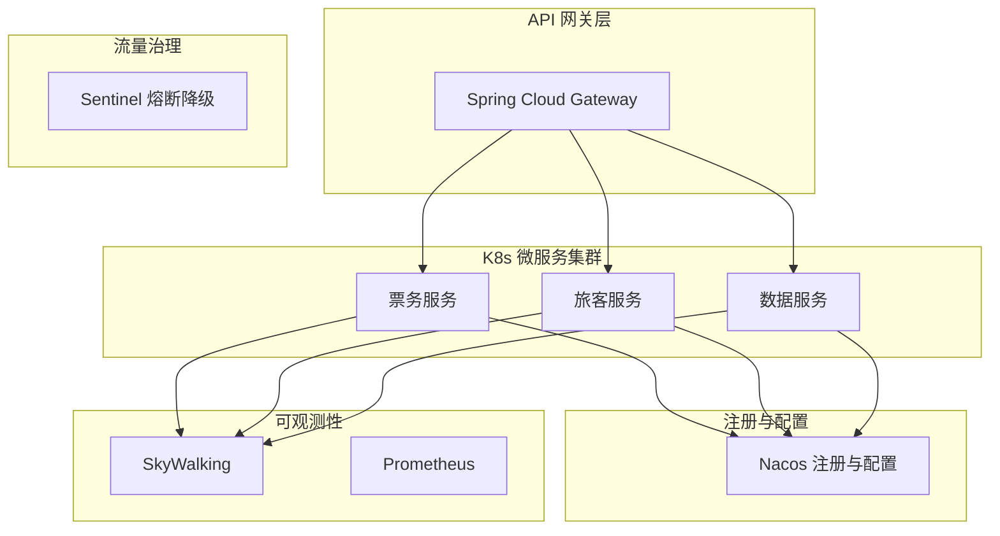

## 1.摘要（字数要求严格限制300字）
2024年3月，我参与某航空公司运营智能管理平台建设，项目面向航空运营机构、机场、旅客等用户，提供航空信息管理、旅客全流程服务、票务交易、航空检修预警、数据智能分析等核心业务功能。项目中，我担任系统架构师，全面负责平台架构设计与核心技术落地。本文围绕微服务治理技术在航空运营场景中的应用展开论述，通过构建服务治理与弹性伸缩机制保障系统高可用与稳定性，基于统一配置与API网关实现服务的精细管理与安全管控，结合全链路可观测性体系提升故障定位与性能优化效率。系统于2025年8月正式上线，截至2026年5月已稳定运行10个月，各项功能及性能指标均达到预设标准，获得客户高度认可。

## 2.项目背景（字数要求严格限制500字左右）
随着国家智慧民航建设战略深入推进，航空运输行业数字化、智能化转型迫在眉睫，《智慧民航建设路线图》等政策明确要求推动航空运营全流程数字化、智能化升级。在此背景下，某航空公司于2024年5月启动航空运营智能管理平台建设，旨在构建覆盖全部航线网络、近百个运营基地及数千万常旅客会员的数字化管理平台，实现航线、航班、票务等核心业务全流程智能管控，年服务旅客超3000万人次，为其提供全场景便捷服务，提升运营效率与服务体验。

我司中标后，我以系统架构师身份负责平台整体架构设计与核心技术落地。平台采用云原生微服务设计，基于 Kubernetes 编排与容器化部署数十个应用服务，涵盖基础支撑、航空信息管理、旅客管理、票务管理、航空检修管理、数据服务及辅助管理等核心模块。业务模块多、服务数量大，节假日高峰日均数十万用户集中办理票务，突发航班变动时访问量激增，对系统稳定性、可观测性与迭代部署提出极高要求，因此我们选用以 Spring Cloud Alibaba 为核心的微服务治理技术体系作为架构基础。

为此，我们团队决定基于微服务治理技术，采用 Nacos 注册发现与配置中心、Sentinel 熔断降级、Spring Cloud Gateway 网关及 SkyWalking 全链路追踪等，构建高可用、可弹性、可观测的云原生微服务平台。平台于2025年8月正式上线，成功应对多轮节假日高并发压力，高效完成年度航班调度、设备检修预警及海量数据处理任务，为旅客提供全流程服务与7*24小时信息支持，上线一年稳定运行，各项指标达标，获得客户与用户一致认可。

## 3. 问题2回应+过度（字数要求严格限制400字）
由于本项目业务模块复杂、服务数量多，对系统稳定性、可观测性与迭代部署有较高要求，若缺乏统一的服务发现、配置管理与流量管控，则故障影响面大、问题定位慢、发布风险高。因此我们选用以 Spring Cloud Alibaba 为核心的微服务治理技术体系，其核心包括：第一，服务注册与发现（Nacos）结合健康检查与 Kubernetes HPA，实现动态扩缩容，配合 Sentinel 实现服务熔断与降级，保障高可用与稳定性；第二，服务配置管理（Nacos Config）与 API 网关（Spring Cloud Gateway），实现统一认证与精细管控；第三，服务链路追踪（SkyWalking）结合指标与日志，打造全链路可观测性，提升故障定位与性能优化效率。

在本项目的实施中，我们通过服务治理与弹性伸缩、统一配置与API网关、全链路可观测性三大实践，完成了微服务治理技术在航空运营智能管理平台中的建设与落地，具体如下。

## 4. 正文部分三段论

### 正文三论点总览表

| 论点 | 要解决的问题 | 方案 / 技术栈 | 核心成效 |
|------|--------------|----------------|----------|
| **论点一：服务治理与弹性伸缩** | 多实例发现、高并发下稳定性与资源弹性 | Nacos 注册发现、健康检查、K8s HPA、Sentinel 熔断降级 | 平均响应≤800ms，系统可用性 99.993% |
| **论点二：统一配置与API网关** | 配置分散、入口不统一与安全管控 | Nacos Config 动态配置、Spring Cloud Gateway、JWT 统一认证 | 服务精细管理与安全访问 |
| **论点三：全链路可观测性** | 故障定位慢、性能瓶颈难排查 | SkyWalking 全链路追踪、Prometheus+Grafana 指标、ELK 日志 | 平均故障定位时间降低约 70% |

## 构建服务治理与弹性伸缩机制，保障系统高可用与稳定性（字数要求严格限制在500-510字左右）
航空运营平台由数十个微服务组成，涵盖票务、旅客、航班、检修、数据服务等模块，服务实例随负载动态扩缩，若缺乏统一的服务发现与健康管理，则调用方无法准确感知可用实例，故障实例仍会被转发请求；高并发时段若不能自动扩容，核心服务易过载导致响应变慢甚至雪崩。为此，我们构建了以 Nacos 为核心的服务注册与发现机制，各微服务启动时向 Nacos 注册并周期性上报健康状态，消费者通过 Nacos 获取健康实例列表并配合负载均衡发起调用，故障实例自动摘除，保障流量只打到健康节点。弹性伸缩方面，结合 Kubernetes 的 HPA（Horizontal Pod Autoscaler），基于 CPU、QPS 等指标在高峰时自动扩容、闲时缩容，使票务、数据服务等核心模块在节假日与突发航班变动场景下保持稳定。此外，引入 Sentinel 实现服务熔断与降级，当依赖服务异常或响应超时达到阈值时自动熔断并返回降级结果，避免故障扩散。通过服务治理与弹性伸缩，核心业务平均响应时间控制在 800ms 以内，系统可用性达 99.993%，成功应对日均超 12 万笔票务交易及 5500 TPS 峰值压力，为智慧民航的高可用运行奠定了坚实基础。

## 实施统一配置与API网关，实现服务的精细管理与安全管控（字数要求严格限制在500-510字左右）
微服务数量多、环境多（开发、测试、生产），若配置分散在各应用本地文件则变更需重新发布、易出错且难以做灰度；对外若缺少统一入口，则鉴权、限流、路由规则无法集中管控，安全与可维护性差。为此，我们采用 Nacos Config 作为统一配置中心，将数据库连接、特征开关、业务参数等按服务与环境管理，支持动态刷新与灰度发布，配置变更无需重启即可生效，大幅降低发布风险。对外统一入口方面，采用 Spring Cloud Gateway 作为 API 网关，所有外部请求经网关路由至后端微服务，在网关上实现统一认证（如 JWT 校验）、限流、路由与协议适配；对旅客端、运营端、管理端等不同来源的请求按策略分流，敏感接口做权限与审计。通过统一配置与 API 网关，实现了服务的精细化管理与安全可控的访问，为多模块、多终端的航空运营平台提供了清晰、可运维的治理能力。

## 打造全链路可观测性体系，提升故障定位与性能优化效率（字数要求严格限制在500-510字左右）
平台一次购票或查询可能经过网关、票务、旅客、航班、数据服务等多个微服务，若仅靠单机日志与指标，难以快速定位跨服务延迟或异常根因，故障恢复与性能优化效率低。为此，我们打造了以 SkyWalking 为核心的全链路可观测性体系。链路追踪上，SkyWalking 对请求在各服务间的调用关系、耗时、异常进行采集与聚合，形成完整 Trace，运维与开发可快速定位慢调用与错误链路。指标监控上，采用 Prometheus 采集各服务的 QPS、延迟、错误率等指标，通过 Grafana 进行大盘展示与告警，核心业务响应时间、可用性等一目了然。日志方面，采用 ELK（Elasticsearch、Logstash、Kibana）集中采集与检索日志，并与 TraceID 关联，便于从链路下钻到具体日志。通过全链路可观测性，平均故障定位时间较建设前降低约 70%，性能瓶颈与异常调用可快速识别并优化，为航空运营平台的稳定运行与持续改进提供了有力支撑。

## 5. 论文总结（字数要求严格限制450字以内）
本平台响应智慧民航建设政策，以微服务治理技术（服务治理与弹性伸缩、统一配置与API网关、全链路可观测性）为核心，构建航空运营全流程一体化管理体系，2025年8月上线后稳定运行一年，超额达成预期目标。上线以来，系统日均处理票务交易超12万笔，核心业务响应时间≤800毫秒，运营效率提升35%，旅客投诉率下降40%，设备故障预警准确率92%，系统可用性达99.993%，峰值处理能力突破5500 TPS，成功应对节假日高并发压力，获行业与旅客广泛认可。微服务治理与弹性伸缩机制保障了核心业务高可用，故障定位时间降低约70%。项目复盘发现架构存在不足：一是高并发叠加场景下，微服务间同步通信偶有延迟，跨模块数据同步耗时增加；二是各模块资源占用不均，辅助服务资源利用率偏低、核心模块高峰资源紧张。后续将针对性优化：引入异步通信与消息队列技术，重构通信链路；搭建智能资源调度平台，通过AI算法实现容器化资源动态分配，提升资源利用率与系统抗突发能力，持续深化技术融合，助力智慧民航高质量发展。

## 6. 系统架构图

**图 1-1** 航空运营智能管理平台·微服务治理技术 架构图
