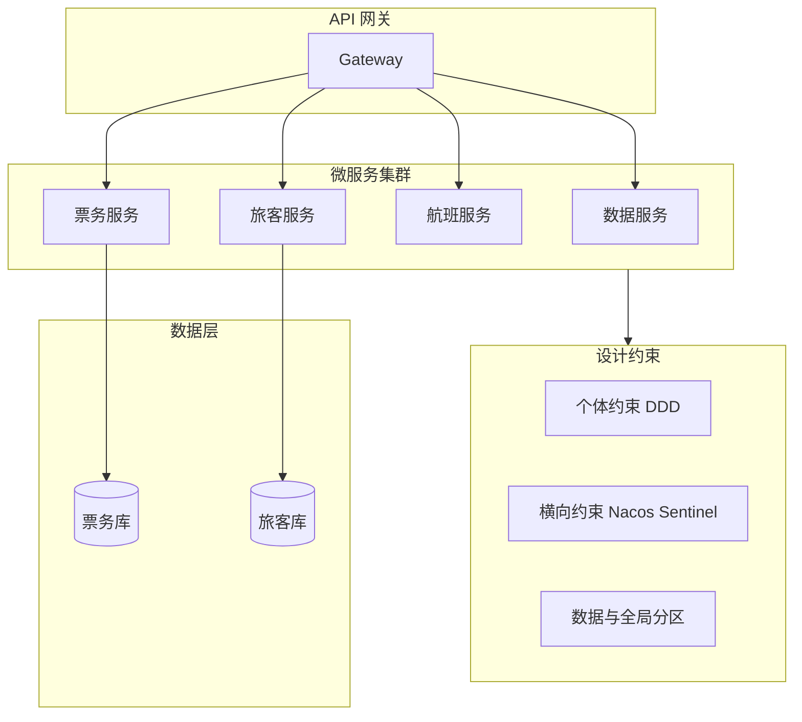

## 1.摘要（字数要求严格限制300字）
2024年3月，我参与某航空公司运营智能管理平台建设，项目面向航空运营机构、机场、旅客等用户，提供航空信息管理、旅客全流程服务、票务交易、航空检修预警、数据智能分析等核心业务功能。项目中，我担任系统架构师，全面负责平台架构设计与核心技术落地。本文围绕微服务设计约束在航空运营场景中的应用展开论述，通过遵循微服务个体约束实现高内聚低耦合与单一职责、清晰服务边界，基于微服务间横向关系约束保障服务协作、数据一致与幂等，结合数据隔离与全局分区约束实现安全可控与自动化部署。系统于2025年8月正式上线，截至2026年5月已稳定运行10个月，各项功能及性能指标均达到预设标准，获得客户高度认可。

## 2.项目背景（字数要求严格限制500字左右）
随着国家智慧民航建设战略深入推进，航空运输行业数字化、智能化转型迫在眉睫，《智慧民航建设路线图》等政策明确要求推动航空运营全流程数字化、智能化升级。在此背景下，某航空公司于2024年5月启动航空运营智能管理平台建设，旨在构建覆盖全部航线网络、近百个运营基地及数千万常旅客会员的数字化管理平台，实现航线、航班、票务等核心业务全流程智能管控，年服务旅客超3000万人次，为其提供全场景便捷服务，提升运营效率与服务体验。

我司中标后，我以系统架构师身份负责平台整体架构设计与核心技术落地。平台采用微服务架构，基于 Kubernetes 容器化部署约三十个微服务，涵盖票务、旅客、航班、检修、数据服务等模块，技术栈包括 Spring Cloud Alibaba、Nacos、Sentinel 等。若服务边界模糊、依赖混乱，则难以独立演进与扩容；若服务间协作与数据一致性缺乏约束，则分布式事务与幂等难以保障；若数据与部署缺乏隔离与标准化，则安全与发布效率受限。因此我们系统引入微服务设计约束，从个体、横向关系、数据隔离与全局分区四方面规范设计与落地。

为此，我们团队决定基于微服务设计约束，采用 DDD 领域驱动设计划分服务边界、Nacos/Sentinel 治理服务间协作与流控、数据隔离与 API 访问控制及 CI/CD 与 K8s 自动化部署，构建高内聚、可协作、安全可控的微服务体系。平台于2025年8月正式上线，成功应对多轮节假日高并发压力，高效完成年度航班调度、设备检修预警及海量数据处理任务，为旅客提供全流程服务与7*24小时信息支持，上线一年稳定运行，各项指标达标，获得客户与用户一致认可。

## 3. 问题2回应+过度（字数要求严格限制400字）
由于本项目微服务数量多、模块联动复杂，若缺乏统一的设计约束，则服务边界不清、依赖混乱，服务间数据一致性与幂等难以保障，数据安全与部署效率也难以统一管控。因此我们系统应用微服务设计约束，其核心包括：第一，微服务个体约束——强调高内聚、低耦合与单一职责（SRP），通过 DDD 领域驱动设计划分限界上下文，实现服务边界清晰、领域内聚；第二，微服务间横向关系约束——规范服务间交互、数据一致性、分布式事务与幂等设计，通过 Nacos、Sentinel 及事件驱动与最终一致性方案，保障协作可靠；第三，微服务与数据隔离约束、全局分区约束——数据隐私、读写分离与 API 访问控制，以及自动化部署、环境一致性与系统可扩展性，通过统一数据访问层与 CI/CD、K8s 落地。

在本项目的实施中，我们通过个体约束、横向关系约束、数据隔离与全局分区约束三大实践，完成了微服务设计约束在航空运营智能管理平台中的建设与落地，具体如下。

## 4. 正文部分三段论

### 正文三论点总览表

| 论点 | 要解决的问题 | 方案 / 技术栈 | 核心成效 |
|------|--------------|----------------|----------|
| **论点一：微服务个体约束** | 服务边界模糊、依赖混乱、难以独立演进 | DDD 限界上下文、高内聚低耦合、单一职责 SRP | 服务边界清晰、领域内聚、独立部署与扩容 |
| **论点二：微服务间横向关系约束** | 服务间协作、数据一致、分布式事务与幂等 | Nacos 发现、Sentinel 流控、事件驱动、Saga/最终一致、幂等设计 | 协作可靠、数据一致、高并发下稳定 |
| **论点三：数据隔离与全局分区约束** | 数据安全、访问可控、部署效率与一致性 | 数据隔离、读写分离、API 访问控制；CI/CD、K8s、环境一致 | 安全可控、上线周期缩短、可扩展 |

## 遵循微服务个体约束，实现高内聚低耦合与单一职责、清晰服务边界（字数要求严格限制在500-510字左右）
航空运营平台包含票务、旅客、航班、检修、数据服务等众多能力，若按传统单体或粗粒度模块划分，则职责交叉、依赖纠缠，单点变更影响面大，难以独立扩容与技术选型。为此，我们严格遵循微服务个体约束，强调高内聚、低耦合与单一职责（SRP）。在设计与拆分阶段，采用 DDD（领域驱动设计）方法，按业务限界上下文划分微服务：票务管理限界上下文对应购票、改签、退票、库存等能力，归属票务相关服务；旅客管理限界上下文对应旅客信息、行程、行李、投诉等，归属旅客服务；航空信息、检修、数据服务等同样按领域边界拆分，确保每个服务只负责一个清晰 bounded context，内部高内聚、对外通过稳定 API 或事件交互，实现低耦合。单一职责上，每个服务聚焦一类业务能力，避免“大而全”，便于团队独立开发、测试与部署。通过个体约束的落地，服务边界清晰、依赖关系可控，新功能与扩容可按服务维度独立进行，为高并发场景下的弹性扩展与快速迭代奠定了坚实基础。

## 落实微服务间横向关系约束，保障服务协作、数据一致与幂等（字数要求严格限制在500-510字左右）
平台内一次购票涉及票务、旅客、航班、数据同步等多服务协作，若缺乏对服务间调用、数据一致性与幂等的约束，则容易出现重复扣款、库存与订单不一致、重试导致重复下单等问题。为此，我们落实微服务间横向关系约束。服务发现与流控方面，采用 Nacos 实现服务注册与发现，保障调用方始终访问健康实例；采用 Sentinel 对热点接口做限流与熔断，高并发时段保护下游服务，避免雪崩。跨服务数据一致性方面，对强一致场景（如扣款与库存）采用分布式事务方案（如 Seata 的 AT 模式或 Saga），对可接受最终一致的场景采用事件驱动：票务服务产生“出票成功”事件，旅客与数据服务异步消费并更新行程与统计，通过幂等消费与补偿机制保障最终一致。接口幂等方面，对购票、改签、退票等写操作采用唯一业务单号或 token 去重，避免重复提交与重试导致的双写。通过横向关系约束，服务间协作可靠、数据一致性与幂等得到保障，系统在日均超 12 万笔交易与 5500 TPS 峰值下保持稳定，可用性达 99.993%。

## 应用数据隔离与全局分区约束，实现安全可控与自动化部署（字数要求严格限制在500-510字左右）
微服务各自持有领域数据，若跨服务随意访问数据库则破坏边界、难以保障数据隐私与安全；若部署与环境缺乏统一规范，则发布效率低、环境差异导致线上问题。为此，我们应用数据隔离与全局分区约束。数据隔离方面，每个微服务独享自身数据库或 Schema，禁止跨服务直连库表，数据协作仅通过 API 或事件完成；对敏感数据（如旅客证件、支付信息）做加密存储与脱敏展示，读写分离与访问控制由服务内部与网关统一管控。全局分区约束方面，通过 CI/CD 流水线实现构建、测试、镜像推送与 K8s 部署的自动化，开发、测试、生产环境配置与镜像版本一致，发布可回滚、可灰度；K8s 的资源与调度策略保证服务可水平扩展，满足节假日与突发流量下的弹性需求。通过数据隔离与全局分区约束，数据安全与访问可控，上线周期缩短、环境一致性与可扩展性得到保障，为航空运营平台的长期稳定与合规运行提供了制度与技术双重保障。

## 5. 论文总结（字数要求严格限制450字以内）
本平台响应智慧民航建设政策，以微服务设计约束（个体约束、横向关系约束、数据隔离与全局分区约束）为核心，构建航空运营全流程一体化管理体系，2025年8月上线后稳定运行一年，超额达成预期目标。上线以来，系统日均处理票务交易超12万笔，核心业务响应时间≤800毫秒，运营效率提升35%，旅客投诉率下降40%，设备故障预警准确率92%，系统可用性达99.993%，峰值处理能力突破5500 TPS，成功应对节假日高并发压力，获行业与旅客广泛认可。微服务设计约束保障了服务边界清晰、协作可靠与数据安全，上线周期缩短、MTTR 显著降低。项目复盘发现架构存在不足：一是高并发叠加场景下，微服务间同步通信偶有延迟，跨模块数据同步耗时增加；二是各模块资源占用不均，辅助服务资源利用率偏低、核心模块高峰资源紧张。后续将针对性优化：引入异步通信与消息队列技术，重构通信链路；搭建智能资源调度平台，通过AI算法实现容器化资源动态分配，并探索服务网格（如 Istio）与 AIOps 能力，提升资源利用率与系统抗突发能力，持续深化技术融合，助力智慧民航高质量发展。

## 6. 系统架构图

**图 2-1** 航空运营智能管理平台·微服务设计约束应用 架构图
