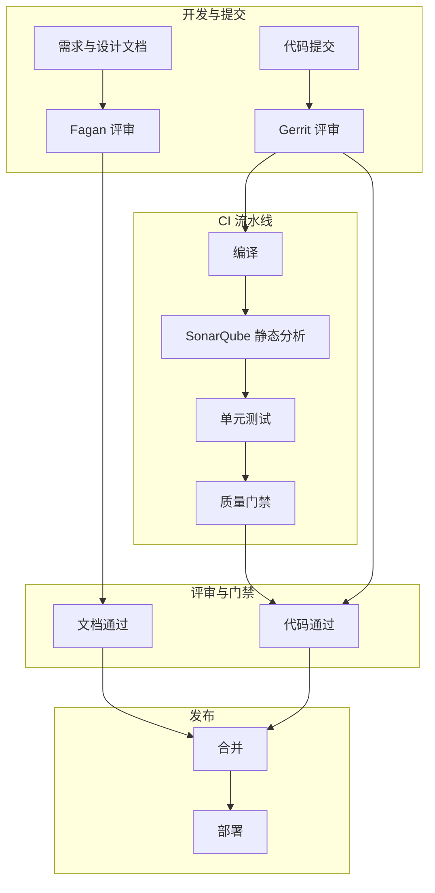

## 1.摘要（字数要求严格限制300字）
2024年3月，我参与某航空公司运营智能管理平台建设，项目面向航空运营机构、机场、旅客等用户，提供航空信息管理、旅客全流程服务、票务交易、航空检修预警、数据智能分析等核心业务功能。项目中，我担任系统架构师，全面负责平台架构设计与核心技术落地。本文围绕静态测试在航空运营平台质量保障中的应用展开论述，通过建立基于 Fagan 审查的需求与设计文档评审机制降低需求与设计偏差，基于 SonarQube 静态分析工具融入 CI/CD 流水线统一编码规范与自动发现缺陷，结合基于 Gerrit 的严格代码评审机制保障核心业务代码正确性与安全。系统于2025年8月正式上线，截至2026年5月已稳定运行10个月，各项功能及性能指标均达到预设标准，获得客户高度认可。

## 2.项目背景（字数要求严格限制500字左右）
随着国家智慧民航建设战略深入推进，航空运输行业数字化、智能化转型迫在眉睫，《智慧民航建设路线图》等政策明确要求推动航空运营全流程数字化、智能化升级。在此背景下，某航空公司于2024年5月启动航空运营智能管理平台建设，旨在构建覆盖全部航线网络、近百个运营基地及数千万常旅客的数字化管理平台，实现航线、航班、票务等核心业务全流程智能管控，同时为每年超3000万旅客提供全场景便捷服务，提升运营效率与服务体验。

我司中标后，我以系统架构师身份负责平台整体架构设计与核心技术落地。平台采用微服务架构部署于 Kubernetes，涵盖票务、旅客、航班、检修、数据服务等百余个微服务，面临突出业务挑战：节假日高峰日均数十万用户集中办理票务，突发航班变动时访问量激增，且需日均处理800GB实时数据、年度累计处理10PB+离线数据。平台涉及资金、订单与敏感数据，业务逻辑复杂，若缺乏系统化的静态测试与代码质量管控，缺陷将遗留至运行时，成本高且风险大。

为此，我们团队决定系统化开展静态测试体系建设，通过需求与设计评审、自动化静态分析、严格代码评审三者结合，在“不运行代码”的前提下尽早发现缺陷、统一规范、保障核心业务正确性与安全。平台于2025年8月正式上线，成功应对多轮节假日高并发压力，高效完成年度航班调度、设备检修预警及海量数据处理任务，为旅客提供全流程服务与7*24小时信息支持，上线一年稳定运行，各项指标达标，获得客户与用户一致认可。

## 3. 问题2回应+过度（字数要求严格限制400字）
由于本项目涉及票务、资金与多模块复杂业务逻辑，仅依赖运行期测试难以在早期发现需求偏差、设计不一致与代码层面的规范与安全缺陷，且团队规模大、微服务多，编码风格与评审标准不统一会加大维护成本与线上风险。因此我们选用静态测试作为质量保障的重要抓手，其核心包括：第一，建立基于 Fagan 审查的需求与设计文档评审机制，通过角色分工与多阶段评审控制需求与设计一致性，减少因理解偏差导致的返工；第二，将 SonarQube 等静态分析工具集成到 CI/CD 流水线，对代码进行自动检查与规范约束，统一编码风格并提前发现潜在缺陷与漏洞；第三，建立基于 Gerrit 的严格代码评审机制，对核心业务与资金相关代码实行多人评审与门禁，保障合入代码的正确性与安全性。

在本项目的实施中，我们通过需求与设计 Fagan 评审、SonarQube 流水线静态分析、以及 Gerrit 代码评审机制三大实践，完成了静态测试体系在航空运营智能管理平台中的建设与落地，具体如下。

## 4. 正文部分三段论

### 正文三论点总览表

| 论点 | 要解决的问题 | 方案 / 技术栈 | 核心成效 |
|------|--------------|----------------|----------|
| **论点一：基于 Fagan 审查的需求与设计文档评审** | 需求与设计文档不一致、理解偏差导致返工与缺陷 | 建立 Fagan 审查机制，需求与设计阶段引入主持人、业务、开发、评审、记录等角色，多阶段评审聚焦关键节点，坚持“问题-方案-效果”逻辑 | 各方理解一致，设计类问题与返工显著减少，为开发与测试提供清晰基线 |
| **论点二：SonarQube 静态分析融入 CI/CD 流水线** | 编码风格不统一、潜在缺陷与安全漏洞难以自动发现 | 将 SonarQube 集成到 Jenkins/CI 流水线，按规范（如阿里巴巴 Java 开发手册）配置规则，每次提交自动扫描并门禁 | 统一编码风格，自动发现并修复大量问题，可维护性与安全性提升，人工排查负担降低 |
| **论点三：基于 Gerrit 的严格代码评审机制** | 核心票务与资金逻辑正确性、安全性依赖人工把关 | 建立“2+2”等人审模型，核心代码须经多人评审；Gerrit 提交前检查与门禁，确保每笔合入经过安全与可靠性检查 | 合入代码质量可控，安全与可靠性风险显著降低，系统稳定性增强 |

## 基于 Fagan 审查的需求与设计文档评审（字数要求严格限制在500-510字左右）
航空运营平台中票务、旅客、航班、检修与数据服务等模块业务关联紧密，需求与设计若在不同角色间理解不一致，易导致开发返工与隐性缺陷。为此，我们建立了基于 Fagan 审查的正式评审机制，覆盖需求与设计阶段。组织上，明确主持人、业务分析、开发、评审与记录等角色，主持人负责节奏与结论闭环，业务与开发分别从业务正确性与可实现性把关，评审侧重一致性与可测性，记录保证问题与结论可追溯。流程上，采用“多阶段评审”，对需求与设计文档中的关键节点（如订单状态机、支付与退票规则、航班与座位一致性等）进行清单化检查，坚持“问题—方案—效果”逻辑，避免含糊表述。评审前发放材料并预留阅读时间，评审中按清单逐项讨论并记录缺陷与改进项，评审后跟踪整改与再审，直至通过。通过上述机制，产品、开发与测试对需求与设计的理解保持一致，设计阶段发现的偏差与遗漏得以在编码前纠正，设计相关返工显著减少，为后续开发与静态分析、代码评审提供了清晰、可追溯的基线，有效降低了因需求与设计错误导致的线上风险。

## SonarQube 静态分析融入 CI/CD 流水线（字数要求严格限制在500-510字左右）
平台由百余个微服务组成，开发团队规模大，若仅依赖人工代码走查难以统一编码规范并在提交前发现潜在缺陷与安全漏洞。为此，我们将 SonarQube 静态分析集成到 CI/CD 流水线，实现“提交即分析、不达标不合并”。技术上，在 Jenkins 或现有 CI 流水线中增加 SonarQube 扫描步骤，对 Java 等语言项目在编译后执行静态分析；规则集上，结合《阿里巴巴 Java 开发手册》等规范进行配置，覆盖命名、注释、复杂度、重复代码、常见缺陷与安全规则（如 SQL 注入、硬编码敏感信息）。质量门禁上，设置缺陷与漏洞的阈值及代码覆盖率要求，扫描结果不通过则流水线失败，阻塞合并，促使开发在提交前修复或说明。通过持续运行，累计发现并修复数千处编码问题与规范不合规项，编码风格趋于统一，可维护性明显提升，安全类问题在合入前得到拦截。静态分析成为开发与评审的辅助手段，在保障航空运营平台代码质量与安全的同时，降低了人工排查成本，为 Gerrit 代码评审提供了自动化前置保障。

## 基于 Gerrit 的严格代码评审机制（字数要求严格限制在500-510字左右）
票务、支付与订单等核心业务代码若未经严格评审即合入，一旦存在逻辑错误或安全漏洞，在高并发与大数据量场景下可能引发资金与订单异常。为此，我们建立了基于 Gerrit 的严格代码评审机制。流程上，核心模块（如订单、支付、库存、行程）采用“2+2”等人审模型：至少两名开发进行交叉评审，两名高级或架构人员进行二次评审，重点检查业务逻辑正确性、边界条件、异常处理与安全合规；普通模块至少一人评审。Gerrit 作为代码托管与评审入口，所有合入均通过 Merge Request 发起，评审通过且 CI（含 SonarQube、单元测试等）通过后方可合并。评审要点上，对涉及资金计算、状态变更与外部调用的代码重点标注，要求说明测试与回滚策略。通过上述机制，每笔合入均经过多轮人工与自动检查，核心业务代码的正确性与安全性得到保障，上线后因代码缺陷导致的安全与可靠性问题显著减少，系统稳定性与客户信任度提升，静态测试体系在“需求—设计—代码”全链路的落地得以闭环。

## 5. 论文总结（字数要求严格限制450字以内）
本平台响应智慧民航建设政策，以静态测试体系（Fagan 评审、SonarQube 静态分析、Gerrit 代码评审）为核心，构建航空运营全流程一体化管理体系，2025年8月上线后稳定运行一年，超额达成预期目标。上线以来，系统日均处理票务交易超12万笔，核心业务响应时间≤800毫秒，运营效率提升35%，旅客投诉率下降40%，设备故障预警准确率92%，系统可用性达99.993%，峰值处理能力突破5500 TPS，成功应对节假日高并发压力，获行业与旅客广泛认可。静态测试方面，SonarQube 累计发现并修复大量编码与规范问题，代码评审使缺陷率显著下降，核心服务可靠性达 99.99% 以上。项目复盘发现，SonarQube 规则仍需随业务持续调优，部分开发在推广初期对工具接受度有限；后期将引入 AI 辅助评审工具提升评审效率，并将静态分析与 DevSecOps 深度融合，持续保障智慧民航平台质量与安全。

## 6. 系统架构图

**图 1-1** 航空运营智能管理平台·静态测试体系架构图
