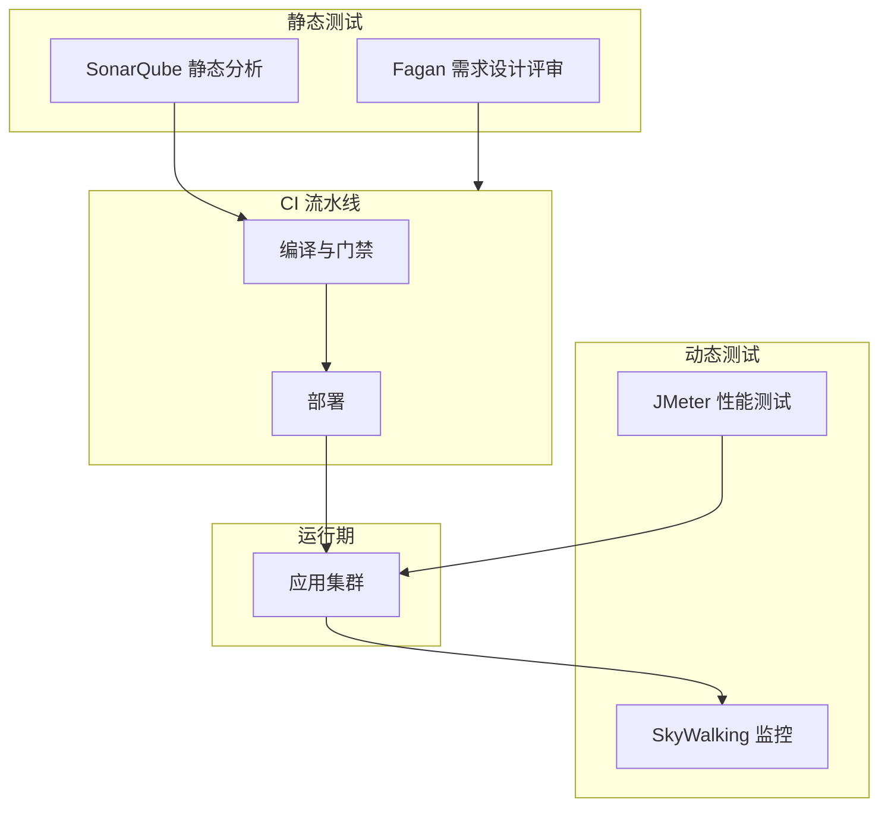

## 1.摘要（字数要求严格限制300字）
2024年3月，我参与某航空公司运营智能管理平台建设，项目面向航空运营机构、机场、旅客等用户，提供航空信息管理、旅客全流程服务、票务交易、航空检修预警、数据智能分析等核心业务功能。项目中，我担任系统架构师，全面负责平台架构设计与核心技术落地。本文围绕静态测试与动态测试在航空运营平台质量保障中的结合应用展开论述，通过 Fagan 审查在需求与设计阶段提前发现关键缺陷，基于 SonarQube 静态分析融入 CI/CD 统一编码质量与安全，结合 JMeter 与 SkyWalking 开展性能测试与监控保障高并发下稳定性与性能指标。系统于2025年8月正式上线，截至2026年5月已稳定运行10个月，各项功能及性能指标均达到预设标准，获得客户高度认可。

## 2.项目背景（字数要求严格限制500字左右）
随着国家智慧民航建设战略深入推进，航空运输行业数字化、智能化转型迫在眉睫，《智慧民航建设路线图》等政策明确要求推动航空运营全流程数字化、智能化升级。在此背景下，某航空公司于2024年5月启动航空运营智能管理平台建设，旨在构建覆盖全部航线网络、近百个运营基地及数千万常旅客的数字化管理平台，实现航线、航班、票务等核心业务全流程智能管控，同时为每年超3000万旅客提供全场景便捷服务，提升运营效率与服务体验。

我司中标后，我以系统架构师身份负责平台整体架构设计与核心技术落地。平台面临突出业务挑战：节假日高峰日均数十万用户集中办理票务，突发航班变动时访问量激增，且需日均处理800GB实时数据、年度累计处理10PB+离线数据，对资源弹性调度、数据处理效率及系统稳定性、安全性提出极高要求。平台涉及资金、订单与多模块复杂业务，质量保障须在“不执行代码”的静态层面与“执行代码”的动态层面同时发力，才能尽早发现缺陷并验证真实运行表现。

为此，我们团队决定将静态测试与动态测试科学结合，通过需求与设计 Fagan 审查、SonarQube 静态分析、以及 JMeter 与 SkyWalking 性能测试与监控，形成“静态抓早、动态验真”的质量保障体系。平台于2025年8月正式上线，成功应对多轮节假日高并发压力，高效完成年度航班调度、设备检修预警及海量数据处理任务，为旅客提供全流程服务与7*24小时信息支持，上线一年稳定运行，各项指标达标，获得客户与用户一致认可。

## 3. 问题2回应+过度（字数要求严格限制400字）
由于本项目业务复杂、数据与资金敏感，仅靠运行期测试无法在需求与设计阶段消除理解偏差与逻辑缺陷，仅靠静态分析也无法验证高并发下的真实性能与稳定性。因此我们采用静态测试与动态测试互补的方案，其核心包括：第一，Fagan 审查应用于需求与设计文档，针对票务-订单-支付-航班等关键业务场景进行角色化评审，提前发现大量需求与设计缺陷；第二，SonarQube 静态代码分析集成到 CI/CD，定制 Java 规则集，在合入前统一编码质量与安全，修复大量代码问题；第三，JMeter 与 SkyWalking 开展全局性能测试与运行期监控，在高并发与高峰场景下定位瓶颈、优化 SQL 与缓存，保障系统可用性 99.993%、日均 12 万笔交易与峰值 5500 TPS、核心接口响应≤600ms。

在本项目的实施中，我们通过 Fagan 审查、SonarQube 静态分析、以及 JMeter 与 SkyWalking 性能测试与监控三大实践，完成了静态与动态测试在航空运营智能管理平台中的结合落地，具体如下。

## 4. 正文部分三段论

### 正文三论点总览表

| 论点 | 要解决的问题 | 方案 / 技术栈 | 核心成效 |
|------|--------------|----------------|----------|
| **论点一：Fagan 审查在需求与设计阶段的应用** | 需求与设计偏差导致返工与隐性缺陷 | 针对票务-订单-支付-航班等关键场景开展 Fagan 审查，项目经理、业务、开发、测试等角色参与，多轮评审 | 提前发现 30% 以上需求与设计类缺陷，团队理解一致，可维护性提升 |
| **论点二：SonarQube 静态分析融入 CI/CD** | 编码风格与质量不一致、潜在缺陷与安全漏洞 | SonarQube 集成 Jenkins，定制 Java 规则集，提交即扫描、门禁不通过不合并 | 发现并修复超 2000 处代码问题，可靠性与安全性提升，不增加额外人工成本 |
| **论点三：JMeter 与 SkyWalking 性能测试与监控** | 高并发下性能瓶颈与稳定性不可见 | JMeter 全局性能测试，SkyWalking 运行期监控与链路分析；SQL 优化、Redis 热数据缓存 | 可用性 99.993%，日均 12 万笔、峰值 5500 TPS，核心接口响应≤600ms，性能风险可控 |

## Fagan 审查在需求与设计阶段的应用（字数要求严格限制在500-510字左右）
航空运营平台中票务、订单、支付、航班运力与旅客行程等业务环环相扣，需求与设计若在项目组内理解不一致，易导致开发返工与测试遗漏。为此，我们在需求与设计阶段系统化应用 Fagan 审查。范围上，针对“订单-支付-库存-行程-通知”等关键业务链路及异常分支（如退票、改签、超售处理）编制评审清单，明确每个节点的输入输出、状态与规则。角色上，组建评审小组：项目经理或产品负责人担任主持人，业务分析师负责业务正确性，高级开发负责可实现性与一致性，测试负责人关注可测性与边界。流程上，评审前发放需求与设计文档并预留阅读时间，评审中按清单逐项讨论并记录缺陷与改进项，评审后跟踪整改并必要时再审。通过多轮审查，累计在需求与设计阶段发现三十余处关键缺陷，避免了将错误传递到编码与测试阶段。静态测试在“不执行代码”的前提下发挥了“抓早”作用，与后续 SonarQube 静态分析、动态测试形成互补，团队对需求与设计的理解趋于一致，可维护性与交付质量显著提升，为平台稳定运行奠定了基础。

## SonarQube 静态分析融入 CI/CD（字数要求严格限制在500-510字左右）
平台由百余个微服务组成，开发团队规模大，若编码规范与质量仅靠人工把控，难以在合入前系统化发现潜在缺陷与安全漏洞。为此，我们将 SonarQube 静态代码分析集成到 CI/CD 流水线。技术上，在 Jenkins 或现有 CI 中增加 SonarQube 扫描步骤，对 Java 等项目在编译后执行分析；规则上，结合《阿里巴巴 Java 开发手册》及项目安全基线定制规则集，覆盖命名、复杂度、重复代码、常见缺陷与安全规则（如 SQL 注入、敏感信息硬编码）。质量门禁上，设置缺陷与漏洞阈值及覆盖率要求，扫描不通过则流水线失败、禁止合并，促使开发在提交前修复或说明。通过持续运行，累计发现并修复超 2000 处代码问题，编码风格与质量趋于统一，代码可靠性与安全性明显提升，且未增加额外人工排查负担。静态分析成为“静态测试”在代码层面的重要组成部分，与 Fagan 审查（需求与设计）、动态性能测试（运行表现）共同构成“静态抓早、动态验真”的完整质量保障链。

## JMeter 与 SkyWalking 性能测试与监控（字数要求严格限制在500-510字左右）
平台在节假日票务高峰与突发航班变动时面临高并发访问，若缺乏系统化的性能测试与运行期监控，瓶颈与稳定性问题难以在上线前暴露与优化。为此，我们结合 JMeter 与 SkyWalking 开展动态性能测试与监控。测试阶段，使用 JMeter 对购票、改签、退票、查询等核心接口进行全局性能测试，模拟数万并发用户与持续负载，采集响应时间、吞吐量与错误率；结合 SkyWalking 对链路与组件进行监控，定位慢接口、慢 SQL 与依赖瓶颈。优化方面，针对发现的慢 SQL 进行索引与语句优化，对热点数据引入 Redis 缓存，对关键服务进行资源与线程池调优。运行期，SkyWalking 持续采集链路与指标，与告警策略联动，便于快速发现性能劣化与异常。通过上述实践，系统在高并发场景下性能瓶颈得到解决，可用性达 99.993%，日均处理票务交易超 12 万笔，峰值 TPS 突破 5500，核心接口响应时间控制在 600ms 以内，动态测试有效验证了静态优化与架构设计在真实负载下的表现，保障了智慧民航平台的稳定性与用户体验。

## 5. 论文总结（字数要求严格限制450字以内）
本平台响应智慧民航建设政策，以静态测试与动态测试相结合的质量保障体系为核心，构建航空运营全流程一体化管理体系，2025年8月上线后稳定运行一年，超额达成预期目标。上线以来，系统日均处理票务交易超12万笔，核心业务响应时间≤800毫秒，运营效率提升35%，旅客投诉率下降40%，设备故障预警准确率92%，系统可用性达99.993%，峰值处理能力突破5500 TPS，成功应对节假日高并发压力，获行业与旅客广泛认可。Fagan 审查在需求与设计阶段发现大量缺陷，SonarQube 累计修复超 2000 处代码问题，核心业务可靠性达 99.99% 以上，投资与交付风险显著降低。项目复盘发现，测试与业务场景的覆盖深度仍有提升空间。后续将推动测试与 AI 的深度融合，探索智能与精准测试，持续提升智慧民航平台的安全与效率。

## 6. 系统架构图

**图 2-1** 航空运营智能管理平台·静态与动态测试体系架构图
