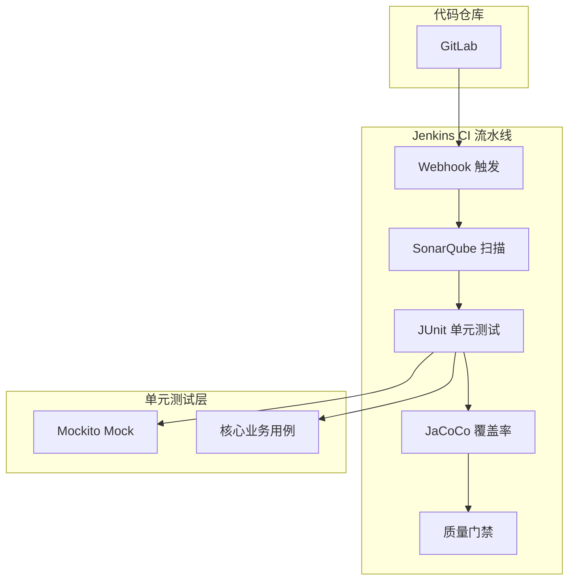

## 1.摘要（字数要求严格限制300字）
2024年3月，我参与某航空公司运营智能管理平台建设，项目面向航空运营机构、机场、旅客等用户，提供航空信息管理、旅客全流程服务、票务交易、航空检修预警、数据智能分析等核心业务功能。项目中，我担任系统架构师，全面负责平台架构设计与核心技术落地。本文围绕单元测试在航空运营平台质量保障中的应用展开论述，通过建立分级测试覆盖率标准聚焦核心业务与高风险模块，基于 Mockito 解耦依赖提升单元测试的可靠性与稳定性，结合自动化 CI/CD 测试流水线实现提交即测与质量门禁。系统于2025年8月正式上线，截至2026年5月已稳定运行10个月，各项功能及性能指标均达到预设标准，获得客户高度认可。

## 2.项目背景（字数要求严格限制500字左右）
随着国家智慧民航建设战略深入推进，航空运输行业数字化、智能化转型迫在眉睫，《智慧民航建设路线图》等政策明确要求推动航空运营全流程数字化、智能化升级。在此背景下，某航空公司于2024年5月启动航空运营智能管理平台建设，旨在构建覆盖全部航线网络、近百个运营基地及数千万常旅客的数字化管理平台，实现航线、航班、票务等核心业务全流程智能管控，同时为每年超3000万旅客提供全场景便捷服务，提升运营效率与服务体验。

我司中标后，我以系统架构师身份负责平台整体架构设计与核心技术落地。平台面临突出业务挑战：节假日高峰日均数十万用户集中办理票务，突发航班变动时访问量激增，且需日均处理800GB实时数据、年度累计处理10PB+离线数据，对资源弹性调度、数据处理效率及系统稳定性、安全性提出极高要求。平台采用微服务架构，票务、支付、订单、航班等核心逻辑分散在各服务内，单元测试作为质量第一道防线，须在编码阶段验证业务正确性并融入持续集成，才能尽早发现缺陷、降低上线风险。

为此，我们团队决定系统化建设单元测试体系，通过分级覆盖率标准、Mockito 解耦依赖、以及自动化 CI/CD 测试流水线，形成“覆盖有重点、测试可重复、提交即反馈”的单元测试能力。平台于2025年8月正式上线，成功应对多轮节假日高并发压力，高效完成年度航班调度、设备检修预警及海量数据处理任务，为旅客提供全流程服务与7*24小时信息支持，上线一年稳定运行，各项指标达标，获得客户与用户一致认可。

## 3. 问题2回应+过度（字数要求严格限制400字）
由于本项目微服务众多、服务间依赖复杂（如 Feign 调用、数据库与缓存），若单元测试强依赖真实环境或外部服务，则测试不稳定、耗时长且难以在 CI 中快速反馈；同时若对所有代码一刀切追求高覆盖率，成本高且重点不突出。因此我们采用“分级覆盖 + Mock 解耦 + 自动化流水线”的单元测试方案，其核心包括：第一，建立分级测试覆盖率标准，对在线支付、订单状态、资金结算等核心功能要求分支与路径覆盖达标（如 100%），其他重要功能要求语句覆盖不低于 80%，通过 JaCoCo 度量并聚焦高风险区域；第二，全面引入 Mockito 对 Feign 客户端、数据库等依赖进行 Mock，保证测试独立、可重复、执行时间从分钟级降至毫秒级；第三，构建基于 Jenkins 的自动化 CI/CD 测试流水线，提交触发静态扫描与 JUnit 单元测试，产出覆盖率报告与门禁，缺陷发现时间从“天”缩短到“分钟”。

在本项目的实施中，我们通过分级覆盖率标准、Mockito 解耦依赖、以及自动化 CI/CD 测试流水线三大实践，完成了单元测试体系在航空运营智能管理平台中的建设与落地，具体如下。

## 4. 正文部分三段论

### 正文三论点总览表

| 论点 | 要解决的问题 | 方案 / 技术栈 | 核心成效 |
|------|--------------|----------------|----------|
| **论点一：分级测试覆盖率标准** | 一刀切覆盖率成本高、重点不突出 | 按业务重要性与复杂度分级：核心（支付、订单、结算）要求分支/路径覆盖 100%，其他重要功能语句覆盖≥80%；JaCoCo 度量 | 资源聚焦高风险模块，保障资金与数据正确性，兼顾质量与成本 |
| **论点二：Mockito 提升单元测试可靠性与稳定性** | 依赖 Feign、DB 等导致测试不稳定、耗时长、Flaky | Mockito Mock Feign 客户端与外部依赖，when-thenReturn 模拟响应；必要时 mockStatic；测试独立、可重复 | 测试从约 60 秒降至毫秒级，无环境依赖，通过率稳定 |
| **论点三：自动化 CI/CD 测试流水线** | 缺陷发现滞后、质量反馈慢 | Jenkins + GitLab Webhook，提交触发 SonarQube、JUnit、JaCoCo、集成/E2E；报告与门禁，不通过不合并 | 核心模块分支覆盖率≥85%，单元测试通过率 100%，缺陷发现从“天”到“分钟” |

## 分级测试覆盖率标准（字数要求严格限制在500-510字左右）
航空运营平台中订单、支付、库存与资金结算等核心逻辑一旦出错，可能直接导致超售、重复扣款或账务不一致，单元测试须对这些模块给予更高覆盖要求；若对所有代码统一追求极高覆盖率，则投入大且收益边际递减。为此，我们建立了分级测试覆盖率标准。分级上，按业务重要性与风险划分：对“在线支付”“订单状态机”“座位库存扣减”“结算与对账”等核心功能，要求分支覆盖率与关键路径覆盖率达到 100%，确保每一分支与关键路径均有测试用例验证；对“旅客信息校验”“航班查询”“通知发送”等重要但非资金直接相关的功能，要求语句覆盖率达到 80% 以上；对一般辅助逻辑则要求不低于 60%，避免遗漏但不过度投入。度量上，采用 JaCoCo 在构建与 CI 中统计各模块的语句、分支与路径覆盖率，并在流水线门禁中按模块类型设置不同阈值，不达标则禁止合并。通过分级标准，测试资源聚焦于高风险与高价值模块，在保障资金与数据正确性的前提下兼顾开发成本，单元测试的投入产出比显著提升，为核心业务上线后的稳定性奠定了基础。

## Mockito 提升单元测试可靠性与稳定性（字数要求严格限制在500-510字左右）
平台微服务间通过 Feign 等方式调用，单元测试若直接依赖真实下游服务与数据库，会面临环境不可用、网络抖动与数据状态不确定等问题，导致测试不稳定（Flaky）且执行时间长，难以在 CI 中快速反馈。为此，我们全面引入 Mockito 对依赖进行 Mock。对 Feign 客户端（如订单服务调用库存服务、支付服务调用账务服务），使用 `when().thenReturn()` 模拟正常与异常响应，使单测仅验证本服务逻辑而不依赖真实远程调用。对数据库访问层，通过 Mock Repository 或内存数据库（如 H2）隔离数据，必要时对静态方法使用 `Mockito.mockStatic` 避免对工具类的真实依赖。测试设计上，每个用例独立准备数据与 Mock 行为，不依赖执行顺序与共享状态，保证可重复执行。通过上述实践，单元测试与外部环境完全解耦，执行时间从原先依赖真实调用的约 60 秒降至毫秒级，CI 中单元测试通过率稳定，Flaky 现象显著减少，开发与 CI 效率提升，单元测试真正成为“提交即验”的质量防线。

## 自动化 CI/CD 测试流水线（字数要求严格限制在500-510字左右）
若单元测试仅靠开发本地执行，缺陷发现滞后且标准不统一，难以在合入前形成统一质量门禁。为此，我们构建了基于 Jenkins 的自动化 CI/CD 测试流水线。触发上，通过 GitLab Webhook 在 Release 或 Master 分支有提交时自动触发流水线。阶段上，依次执行：代码静态扫描（SonarQube）、依赖检查（Maven/Gradle）、JUnit 5 单元测试并生成 JaCoCo 覆盖率报告、集成测试、关键路径 E2E 测试，最终发布测试报告。门禁上，单元测试失败或核心模块覆盖率不达标（如分支覆盖率低于 85%）则流水线失败，禁止合并，促使开发在提交前修复用例或补充覆盖。报告上，每次运行产出覆盖率趋势与失败用例列表，便于定位与回溯。通过上述机制，核心模块分支覆盖率达到 85% 以上，单元测试通过率 100%，缺陷在测试阶段发现率超过 90%，缺陷发现时间从原先的“天”缩短到“分钟”，平台持续集成与持续交付能力显著增强，上线后系统可靠性达 99.99% 以上，单元测试体系在航空运营平台的质量保障中发挥了关键作用。

## 5. 论文总结（字数要求严格限制450字以内）
本平台响应智慧民航建设政策，以单元测试体系（分级覆盖率、Mockito 解耦、自动化 CI/CD 测试）为核心，构建航空运营全流程一体化管理体系，2025年8月上线后稳定运行一年，超额达成预期目标。上线以来，系统日均处理票务交易超12万笔，核心业务响应时间≤800毫秒，运营效率提升35%，旅客投诉率下降40%，设备故障预警准确率92%，系统可用性达99.993%，峰值处理能力突破5500 TPS，成功应对节假日高并发压力，获行业与旅客广泛认可。单元测试方面，核心模块分支覆盖率≥85%，缺陷密度低于千行 0.5 个，测试阶段缺陷发现率超 90%。项目复盘发现，在代码库与迭代节奏进一步扩大时，可引入测试影响分析（TIA）提升回归效率，并探索 AI 辅助 TDD 自动生成与修复用例，持续提升覆盖率与开发效率，助力智慧民航平台质量保障。

## 6. 系统架构图

**图 3-1** 航空运营智能管理平台·单元测试与 CI 流水线架构图
