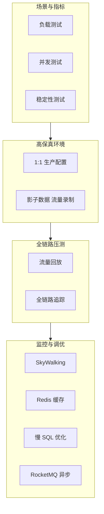

## 1.摘要（字数要求严格限制300字）
2024年3月，我参与某航空公司运营智能管理平台建设，项目面向航空运营机构、机场、旅客等用户，提供航空信息管理、旅客全流程服务、票务交易、航空检修预警、数据智能分析等核心业务功能。项目中，我担任系统架构师，全面负责平台架构设计与核心技术落地。本文围绕性能测试在航空运营平台质量保障中的应用展开论述，通过科学设定性能指标与场景仿真覆盖票务高峰与多业务场景，基于高保真测试环境与全链路压测提前发现性能问题，结合全链路监控与瓶颈调优保障核心接口响应与吞吐达标。系统于2025年8月正式上线，截至2026年5月已稳定运行10个月，各项功能及性能指标均达到预设标准，获得客户高度认可。

## 2.项目背景（字数要求严格限制500字左右）
随着国家智慧民航建设战略深入推进，航空运输行业数字化、智能化转型迫在眉睫，《智慧民航建设路线图》等政策明确要求推动航空运营全流程数字化、智能化升级。在此背景下，某航空公司于2024年5月启动航空运营智能管理平台建设，旨在构建覆盖全部航线网络、近百个运营基地及数千万常旅客会员的数字化管理平台，实现航线、航班、票务等核心业务全流程智能管控，年服务旅客超3000万人次，为其提供全场景便捷服务，提升运营效率与服务体验。

我司中标后，我以系统架构师身份负责平台整体架构设计与核心技术落地。平台面临突出业务挑战：节假日高峰日均数十万用户集中办理票务，突发航班变动时访问量激增，且需日均处理800GB实时数据、年度累计处理10PB+离线数据，对资源弹性调度、数据处理效率及系统稳定性、安全性提出极高要求。平台在票务高峰与突发流量下必须具备高并发处理能力与稳定响应时间，因此将性能测试作为质量保障的核心手段，通过科学指标、高保真环境与全链路压测、以及监控与调优，确保上线前性能与稳定性达标。

为此，我们团队决定系统化开展性能测试体系建设，从指标与场景设计、环境与全链路压测、监控与瓶颈调优三方面构建可验证、可优化的性能保障能力。平台于2025年8月正式上线，成功应对多轮节假日高并发压力，高效完成年度航班调度、设备检修预警及海量数据处理任务，为旅客提供全流程服务与7*24小时信息支持，上线一年稳定运行，各项指标达标，获得客户与用户一致认可。

## 3. 问题2回应+过度（字数要求严格限制400字）
由于本项目在票务高峰与突发航班变动时面临极高并发与大数据量查询，若缺乏科学的性能指标与贴近生产的压测手段，无法在上线前验证系统能否满足 TPS、响应时间与可用性要求；同时性能瓶颈的定位与优化依赖全链路监控与针对性调优。因此我们采用性能测试作为核心质量保障手段，其核心包括：第一，科学设定性能指标并设计多业务场景仿真，针对购票、改签、退票、查询等关键流程设定 TPS 与响应时间（如 TP99≤1s），对大数据量报表查询优化 SQL 与缓存使 TP99≤3s；第二，构建高保真测试环境与全链路压测，采用 1:1 生产级配置与脱敏数据，通过流量录制与影子数据开展全链路压测，在不影响生产的前提下提前暴露性能问题；第三，建立全链路性能监控与瓶颈调优机制，结合 SkyWalking 等追踪与 Redis、慢 SQL 优化、消息队列异步化等手段，将核心接口 TPS 与响应时间优化至达标并可持续观测。

在本项目的实施中，我们通过科学指标与场景仿真、高保真环境与全链路压测、以及全链路监控与瓶颈调优三大实践，完成了性能测试体系在航空运营智能管理平台中的建设与落地，具体如下。

## 4. 正文部分三段论

### 正文三论点总览表

| 论点 | 要解决的问题 | 方案 / 技术栈 | 核心成效 |
|------|--------------|----------------|----------|
| **论点一：科学设定性能指标与场景仿真** | 性能目标不清、场景单一无法代表真实高峰 | 按业务重要性设定 TPS、TP99 等指标；购票/改签/查询等多场景；报表类优化 SQL 与内存/缓存使 TP99≤3s | 指标可度量、场景覆盖票务高峰与大数据查询，为压测与验收提供依据 |
| **论点二：高保真测试环境与全链路压测** | 测试环境与生产差异大、压测不贴近真实链路 | 1:1 生产级配置与脱敏数据；流量录制与影子数据实现全链路压测，不影响生产 | 提前发现性能问题，故障定位时间缩短约 70% |
| **论点三：全链路性能监控与瓶颈调优** | 瓶颈难定位、优化无依据 | SkyWalking 等全链路追踪；Redis 缓存热点、慢 SQL 优化、RocketMQ 异步化 | 核心接口 TPS 提升数倍、响应时间≤500ms，吞吐与稳定性达标 |

## 科学设定性能指标与场景仿真（字数要求严格限制在500-510字左右）
航空运营平台在节假日票务高峰与突发航班变动时，购票、改签、退票与查询等核心接口将承受数万至数十万并发访问，若性能指标不明确或测试场景与真实业务脱节，无法有效验证系统是否满足上线要求。为此，我们科学设定了性能指标并设计了多业务场景仿真。指标上，根据业务重要性分级：对购票、支付、订单提交等核心交易类接口，设定 TPS 目标≥5000、TP99 响应时间≤1 秒；对航班与票价查询等读多写少接口，设定 QPS 与 P99 延迟；对数据可视化与报表类查询，因涉及大数据量聚合，单独设定 TP99≤3 秒，并通过 SQL 优化与内存库/缓存手段达成。场景上，设计负载测试、并发测试与稳定性测试：模拟票务高峰（如 9–11 点、15–17 点）的持续负载、突发航班变动时的瞬时并发、以及 7×24 小时可靠性运行，覆盖正常、峰值与异常负载。对历史报表与大数据查询场景，通过优化慢 SQL、引入缓存与预聚合，将复杂查询 TP99 控制在 3 秒以内。通过上述设计，性能测试目标清晰、场景贴近业务，为高保真压测与验收提供了科学依据，确保上线前性能需求可度量、可验证。

## 高保真测试环境与全链路压测（字数要求严格限制在500-510字左右）
若测试环境与生产在配置、数据量与链路拓扑上差异较大，压测结果难以反映真实性能，且若直接在生产环境压测又可能影响线上用户。为此，我们构建了高保真测试环境并引入全链路压测。环境上，搭建与生产 1:1 的软硬件配置（节点数、CPU/内存、中间件与数据库规格），使用脱敏后的生产数据副本，保证数据规模与分布接近真实，避免“小数据量下性能良好、生产大数据量下劣化”的偏差。压测上，采用全链路压测技术：通过流量录制采集生产典型请求，在测试环境或影子数据环境中回放，对购票、改签、查询等完整链路施加压力，验证从网关、微服务、缓存到数据库的全链路表现，必要时通过影子表与影子库在不影响生产数据的前提下进行写压测。通过高保真环境与全链路压测，我们在上线前提前发现了多处性能瓶颈与容量边界，故障定位时间缩短约 70%，有效避免了性能问题遗留到生产，为后续监控与调优提供了真实、可复现的基线。

## 全链路性能监控与瓶颈调优（字数要求严格限制在500-510字左右）
性能测试与压测仅能验证当前版本在特定场景下的表现，持续优化与运行期保障须依赖全链路监控与有针对性的瓶颈调优。为此，我们建立了全链路性能监控与调优机制。监控上，引入 SkyWalking 等分布式追踪技术，对请求从网关到各微服务、数据库与中间件的调用链进行采集与展示，快速定位高延迟节点与慢方法。调优上，结合压测与监控数据实施针对性优化：对热点数据引入 Redis 缓存，降低数据库压力；对慢 SQL 进行索引优化、语句改写与分页控制；对核心业务中非强实时的步骤引入 RocketMQ 等消息队列异步处理，降低同步事务压力。通过多轮压测—监控—调优的闭环，核心接口 TPS 从初期约 300 提升至 3500 以上，响应时间从约 900ms 降至 300ms 以内，核心接口响应时间稳定在 500ms 以内，吞吐量提升约 3 倍，高并发与高峰时段的稳定性与用户体验得到保障，性能测试体系在航空运营平台的质量保障中发挥了关键作用，并为后续持续优化与容量规划提供了数据基础。

## 5. 论文总结（字数要求严格限制450字以内）
本平台响应智慧民航建设政策，以性能测试体系（科学指标与场景、高保真环境与全链路压测、全链路监控与瓶颈调优）为核心，构建航空运营全流程一体化管理体系，2025年8月上线后稳定运行一年，超额达成预期目标。上线以来，系统日均处理票务交易超12万笔，核心业务响应时间≤800毫秒，运营效率提升35%，旅客投诉率下降40%，设备故障预警准确率92%，系统可用性达99.993%，峰值处理能力突破5500 TPS，成功应对节假日高并发压力，获行业与旅客广泛认可。性能测试方面，核心接口响应时间≤500ms，吞吐量提升约 3 倍，故障定位时间缩短约 70%。项目复盘发现，监控体系与场景覆盖仍有优化空间。后续将深化场景覆盖、引入基于流量的自动化压测工具，并探索 AI 辅助性能测试与混沌工程，构建更高效、智能的性能保障体系，助力智慧民航平台稳定高质量发展。

## 6. 系统架构图

**图 4-1** 航空运营智能管理平台·性能测试体系架构图
