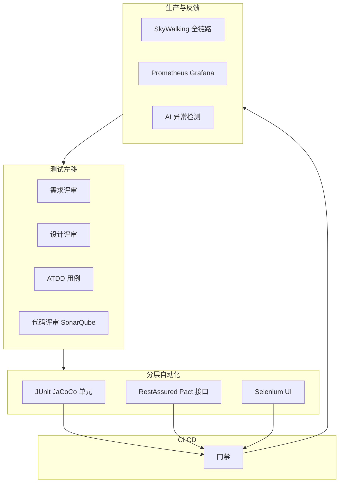

## 1.摘要（字数要求严格限制300字）
2024年3月，我参与某航空公司运营智能管理平台建设，项目面向航空运营机构、机场、旅客等用户，提供航空信息管理、旅客全流程服务、票务交易、航空检修预警、数据智能分析等核心业务功能。项目中，我担任系统架构师，全面负责平台架构设计与核心技术落地。本文围绕自动化融合测试在航空运营平台质量保障中的应用展开论述，通过测试左移与 ATDD 在需求与设计阶段提前发现缺陷并生成可测用例，基于分层自动化测试体系（单元、接口、UI）提升执行效率与稳定性，结合全链路监控与智能质量反馈形成测试与生产的闭环。系统于2025年8月正式上线，截至2026年5月已稳定运行10个月，各项功能及性能指标均达到预设标准，获得客户高度认可。

## 2.项目背景（字数要求严格限制500字左右）
随着国家智慧民航建设战略深入推进，航空运输行业数字化、智能化转型迫在眉睫，《智慧民航建设路线图》等政策明确要求推动航空运营全流程数字化、智能化升级。在此背景下，某航空公司于2024年5月启动航空运营智能管理平台建设，旨在构建覆盖全部航线网络、近百个运营基地及数千万常旅客的数字化管理平台，实现航线、航班、票务等核心业务全流程智能管控，同时为每年超3000万旅客提供全场景便捷服务，提升运营效率与服务体验。

我司中标后，我以系统架构师身份负责平台整体架构设计与核心技术落地。平台面临突出业务挑战：节假日高峰日均数十万用户集中办理票务，突发航班变动时访问量激增，且需日均处理800GB实时数据、年度累计处理10PB+离线数据，对资源弹性调度、数据处理效率及系统稳定性、安全性提出极高要求。平台微服务多、链路长，传统“后期集中测试”模式缺陷发现晚、成本高，须向“自动化+智能化+全链路”的融合测试转型，实现测试左移、分层自动化与生产质量反馈闭环。

为此，我们团队决定系统化开展自动化融合测试建设，通过测试左移与 ATDD、分层自动化测试体系、以及智能监控与质量反馈闭环，形成“早发现、快执行、可反馈”的融合测试能力。平台于2025年8月正式上线，成功应对多轮节假日高并发压力，高效完成年度航班调度、设备检修预警及海量数据处理任务，为旅客提供全流程服务与7*24小时信息支持，上线一年稳定运行，各项指标达标，获得客户与用户一致认可。

## 3. 问题2回应+过度（字数要求严格限制400字）
由于本项目业务复杂、微服务与接口众多，若测试集中在开发完成后执行，缺陷发现晚、修复成本高，且纯手工测试无法支撑频繁回归与发布节奏。因此我们采用“自动化+智能化+全链路”的融合测试方案，其核心包括：第一，测试左移与 ATDD，在需求与设计评审阶段引入可测性检查与 ATDD 用例生成，在代码评审中集成 SonarQube 等静态分析，提前发现缺陷、缺陷修复成本降低约 70%；第二，分层自动化测试体系，单元测试（约 70%）采用 JUnit 与 JaCoCo，合并请求要求覆盖率≥80%，接口测试（约 20%）采用 RestAssured、Swagger 与 Pact 契约测试，UI 测试（约 10%）采用 Selenium 覆盖票务、旅客、航班等关键界面，提升执行效率与回归稳定性；第三，智能监控与质量反馈闭环，通过 SkyWalking 全链路追踪、Prometheus 与 Grafana 指标监控、以及 AI 异常检测与告警，将生产问题与测试用例关联，形成质量反馈闭环，平均响应时间从“小时”降至“分钟”，测试覆盖率提升至 92%。

在本项目的实施中，我们通过测试左移与 ATDD、分层自动化测试体系、以及智能监控与质量反馈闭环三大实践，完成了自动化融合测试在航空运营智能管理平台中的建设与落地，具体如下。

## 4. 正文部分三段论

### 正文三论点总览表

| 论点 | 要解决的问题 | 方案 / 技术栈 | 核心成效 |
|------|--------------|----------------|----------|
| **论点一：测试左移与 ATDD** | 缺陷在后期才发现、修复成本高 | 需求与设计评审引入可测性；ATDD 根据需求生成可执行用例；代码评审集成 SonarQube；早期发现遗漏与矛盾 | 缺陷发现前移，修复成本降低约 70%，测试覆盖率>93% |
| **论点二：分层自动化测试体系** | 回归依赖手工、效率低、不稳定 | 单元 70%（JUnit+JaCoCo，MR 覆盖率≥80%）、接口 20%（RestAssured、Swagger、Pact）、UI 10%（Selenium） | 自动化执行效率提升约 5 倍，缺陷成本降 70%，交付提前约 15 天 |
| **论点三：智能监控与质量反馈闭环** | 生产问题与测试脱节、响应慢 | SkyWalking 全链路、Prometheus+Grafana 指标、AI 异常检测与告警，生产问题与用例关联 | 平均响应时间从小时级到分钟级，测试用例覆盖率 92% |

## 测试左移与 ATDD（字数要求严格限制在500-510字左右）
航空运营平台中票务、订单、支付与航班等业务逻辑复杂，若测试仅在开发完成后介入，需求与设计阶段的遗漏、矛盾与不可测设计将传导至编码与测试，缺陷修复成本成倍增加。为此，我们实施测试左移并引入 ATDD。左移方面，在需求评审阶段由测试与产品共同检查需求的完整性、一致性与可测性，对“缺少校验前置数据”等模糊点提前澄清，避免开发完成后再发现导致约 3 天返工；在设计评审阶段检查接口与状态设计是否可测、边界是否明确。ATDD 方面，在需求确定后由业务、开发与测试共同编写验收标准与场景，并转化为可执行的验收测试用例（如 Given-When-Then 形式），在实现前即锁定“完成定义”，开发过程中按用例实现并持续运行，确保需求与实现一致且可测。代码评审阶段集成 SonarQube 静态分析，对合入代码进行质量与安全门禁，并与单元测试覆盖率联动，要求核心模块覆盖率达标方可合并。通过测试左移与 ATDD，缺陷在需求与设计阶段即被大量发现与纠正，缺陷修复成本降低约 70%，测试覆盖率超过 93%，为分层自动化测试与生产质量反馈提供了高质量需求与可执行用例基础。

## 分层自动化测试体系（字数要求严格限制在500-510字左右）
平台微服务与接口众多，若回归主要依赖手工测试，效率低、周期长且难以支撑频繁发布。为此，我们构建了分层自动化测试体系，按“单元 70%、接口 20%、UI 10%”的比例分配自动化投入。单元层，采用 JUnit 与 JaCoCo，对核心业务与公共组件编写单元测试，合并请求（MR）要求覆盖率≥80%，不达标禁止合并，保证合入代码具备基本正确性。接口层，采用 RestAssured 编写接口自动化用例，结合 Swagger 维护接口文档与用例一致性，对关键服务间契约采用 Pact 等消费者驱动契约测试，保障上下游接口兼容；累计建设 300+ 接口用例，覆盖票务、旅客、航班、检修与数据服务等核心 API。UI 层，采用 Selenium 对票务、旅客、航班、检修与数据服务等关键前端流程进行自动化回归，占比约 10%，重点保障主流程可用的同时控制维护成本。三层用例纳入 CI/CD，提交或定时触发执行，产出报告与门禁。通过分层自动化，测试执行效率提升约 5 倍，缺陷发现从后期前移至开发与集成阶段，缺陷成本降低约 70%，项目交付周期缩短约 15 天，自动化融合测试成为发布与回归的稳定保障。

## 智能监控与质量反馈闭环（字数要求严格限制在500-510字左右）
测试与生产若脱节，生产问题难以快速回溯到测试用例与场景，质量改进缺乏数据支撑。为此，我们建立了智能监控与质量反馈闭环。监控上，采用 SkyWalking 对生产与预发环境进行全链路追踪，问题发生时快速定位到具体服务与调用链；采用 Prometheus 与 Grafana 对系统性能、业务指标与错误率进行实时监控与可视化。智能告警上，引入基于 AI/机器学习的异常检测，对响应时间、错误率与业务指标的突变进行识别与告警，减少误报的同时缩短发现时延。质量反馈上，将生产问题与测试用例关联：典型故障与线上缺陷转化为或补充为自动化用例或手工用例场景，纳入回归与发布前检查，形成“生产问题—用例补充—回归验证”的闭环。通过上述机制，生产问题的平均响应时间从“小时”级降至“分钟”级，测试用例对业务与链路的覆盖提升至 92%，自动化融合测试与生产质量形成良性互动，持续提升智慧民航平台的稳定性与用户满意度。

## 5. 论文总结（字数要求严格限制450字以内）
本平台响应智慧民航建设政策，以自动化融合测试（测试左移与 ATDD、分层自动化、智能监控与质量反馈）为核心，构建航空运营全流程一体化管理体系，2025年8月上线后稳定运行一年，超额达成预期目标。上线以来，系统日均处理票务交易超12万笔，核心业务响应时间≤800毫秒，运营效率提升35%，旅客投诉率下降40%，设备故障预警准确率92%，系统可用性达99.993%，峰值处理能力突破5500 TPS，成功应对节假日高并发压力，获行业与旅客广泛认可。自动化测试执行效率提升约 5 倍，测试覆盖率 92%，缺陷成本降低约 70%。项目复盘发现，可进一步引入基于模型的自动化测试与 AI 驱动用例生成，提升安全、稳定与智能化水平。后续将深化自动化融合测试与 DevOps 的协同，持续助力智慧民航高质量发展。

## 6. 系统架构图

**图 5-1** 航空运营智能管理平台·自动化融合测试体系架构图
