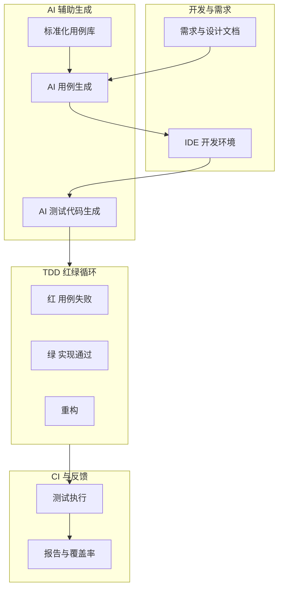

## 1.摘要（字数要求严格限制300字）
2024年3月，我参与某航空公司运营智能管理平台建设，项目面向航空运营机构、机场、旅客等用户，提供航空信息管理、旅客全流程服务、票务交易、航空检修预警、数据智能分析等核心业务功能。项目中，我担任系统架构师，全面负责平台架构设计与核心技术落地。本文围绕 AI 辅助 TDD 在航空运营平台质量保障中的应用展开论述，通过基于标准化用例库的 TDD 流程实现“测试先行”并缩短准备时间，基于 AI 生成边界与异常用例驱动核心业务逻辑健壮实现，结合 IDE 内嵌 AI 的测试代码生成与维护降低 TDD 采纳成本并提升覆盖率。系统于2025年8月正式上线，截至2026年5月已稳定运行10个月，各项功能及性能指标均达到预设标准，获得客户高度认可。

## 2.项目背景（字数要求严格限制500字左右）
随着国家智慧民航建设战略深入推进，航空运输行业数字化、智能化转型迫在眉睫，《智慧民航建设路线图》等政策明确要求推动航空运营全流程数字化、智能化升级。在此背景下，某航空公司于2024年5月启动航空运营智能管理平台建设，旨在构建覆盖全部航线网络、近百个运营基地及数千万常旅客的数字化管理平台，实现航线、航班、票务等核心业务全流程智能管控，同时为每年超3000万旅客提供全场景便捷服务，提升运营效率与服务体验。

我司中标后，我以系统架构师身份负责平台整体架构设计与核心技术落地。平台面临突出业务挑战：节假日高峰日均数十万用户集中办理票务，突发航班变动时访问量激增，且需日均处理800GB实时数据、年度累计处理10PB+离线数据，对资源弹性调度、数据处理效率及系统稳定性、安全性提出极高要求。传统 TDD 依赖人工编写大量用例与测试代码，在高并发、大数据量与复杂业务场景下效率与覆盖度受限，因此我们引入 AI 辅助 TDD，通过标准化用例库、AI 边界用例生成与 IDE 内测试代码智能生成，提升 TDD 落地效果与研发效率。

为此，我们团队决定系统化推进 AI 辅助 TDD 建设，从标准化用例库与 TDD 流程、AI 边界与异常用例驱动、以及 IDE 内 AI 测试代码生成与维护三方面形成“测试先行、边界补齐、成本可控”的 TDD 体系。平台于2025年8月正式上线，成功应对多轮节假日高并发压力，高效完成年度航班调度、设备检修预警及海量数据处理任务，为旅客提供全流程服务与7*24小时信息支持，上线一年稳定运行，各项指标达标，获得客户与用户一致认可。

## 3. 问题2回应+过度（字数要求严格限制400字）
由于本项目业务复杂、微服务多，纯人工 TDD 存在用例准备耗时长、边界与异常场景易遗漏、测试代码编写与维护负担大（传统 TDD 约增加 30%–50% 代码量）等问题，制约 TDD 的推广与质量效果。因此我们采用 AI 辅助 TDD 方案，其核心包括：第一，建立基于标准化测试用例库的 TDD 流程，通过历史用例与需求文档构建 AI 知识库，由 AI 从需求与设计文档生成标准化用例并经人工审核后提供给开发，实现“测试先行”，TDD 准备时间缩短约 85%；第二，将 AI 生成的边界与异常用例纳入 TDD 红绿循环，针对空值、极值、并发等场景生成用例，驱动核心业务逻辑健壮实现，累计发现 30 余处潜在缺陷；第三，在 IDE 内集成 AI 测试代码生成与维护，根据需求或代码变更自动生成/更新测试代码（如 Mockito），降低 TDD 采纳成本，TDD 覆盖率提升至接近 100%，一次性通过率显著提高。

在本项目的实施中，我们通过标准化用例库与 TDD 流程、AI 边界用例驱动、以及 IDE 内 AI 测试代码生成与维护三大实践，完成了 AI 辅助 TDD 在航空运营智能管理平台中的建设与落地，具体如下。

## 4. 正文部分三段论

### 正文三论点总览表

| 论点 | 要解决的问题 | 方案 / 技术栈 | 核心成效 |
|------|--------------|----------------|----------|
| **论点一：基于标准化用例库的 TDD 流程** | 需求与开发易偏差、人工 TDD 用例准备慢 | 构建用例库与 AI 知识库；从需求/设计文档生成标准化用例（ID、前置、步骤、输入输出）；测试审核后提供给开发，实现测试先行 | TDD 准备时间缩短约 85%，需求与设计一致性提升 |
| **论点二：AI 生成边界用例驱动核心逻辑健壮** | TDD 多覆盖主流程、边界与异常易漏 | AI 根据业务与技术栈生成边界用例（空值、极值、无效参数、并发等），纳入红绿循环 | 发现 30+ 潜在缺陷，核心业务健壮性显著提升 |
| **论点三：IDE 内 AI 测试代码生成与维护** | 测试代码编写与维护负担大、TDD 采纳成本高 | IDE 集成 AI，根据需求或代码变更生成/更新测试代码（Mockito 等），变更时自动更新受影响用例 | TDD 覆盖率近 100%，一次性通过率大幅提升，采纳成本降低 |

## 基于标准化用例库的 TDD 流程（字数要求严格限制在500-510字左右）
航空运营平台中票务、订单与支付等需求若与开发理解不一致，易导致实现偏差与返工；传统 TDD 下开发需先手工编写大量用例再写实现，准备阶段耗时长，影响“测试先行”的落地。为此，我们建立了基于标准化测试用例库的 TDD 流程。知识库方面，收集历史测试用例、需求文档与用户故事，进行清洗、分类与抽取，形成可供 AI 使用的知识库。标准化方面，将用例统一为结构化格式（如 JSON/YAML），包含用例 ID、名称、前置条件、步骤、输入与预期输出等字段，便于生成、评审与复用。流程方面，在需求与设计阶段即向 AI 输入需求或设计要点，由 AI 生成初版测试用例，经测试人员审核、筛选与修正后提供给开发，开发在实现前即获得可执行用例，实现“测试先行”；AI 生成的用例与需求、设计对齐，减少需求与实现偏差。通过上述机制，TDD 准备时间缩短约 85%，需求与设计的一致性得到保障，“设计即可测、实现即验证”的 TDD 理念得以落地，为 AI 边界用例与 IDE 内测试代码生成提供了标准化输入与流程基础。

## AI 生成边界用例驱动核心逻辑健壮（字数要求严格限制在500-510字左右）
TDD 实践中开发往往优先编写“主流程”用例，对空值、极值、无效参数与并发等边界与异常场景覆盖不足，导致核心业务在极端或异常输入下出现潜在缺陷。为此，我们引入 AI 生成的边界与异常用例并纳入 TDD 红绿循环。AI 根据业务上下文、技术栈（如微服务、分布式事务、高并发）及历史缺陷数据，自动生成针对性的边界用例，例如：订单号为空或非法、金额为 0 或超大值、库存不足、重复提交、并发下单等。这些用例经简要审核后加入用例库，开发在实现功能时须先让这些用例由红变绿，再完成主流程实现，从而驱动核心业务逻辑在边界与异常场景下的健壮实现。实践表明，AI 生成的边界用例在计算与基础设施相关逻辑中累计发现 30 余处潜在缺陷，核心业务健壮性与线上缺陷率显著改善，AI 辅助 TDD 在“补齐边界、提升鲁棒性”方面发挥了重要作用。

## IDE 内 AI 测试代码生成与维护（字数要求严格限制在500-510字左右）
TDD 会带来额外测试代码的编写与维护，传统估算显示测试代码量可能增加 30%–50%，部分开发因负担重而抵触 TDD。为此，我们在 IDE 内集成 AI 测试代码生成与维护能力。生成方面，开发在编写或修改业务代码时，通过自然语言提示或选中代码请求 AI 生成对应测试代码；AI 根据项目技术栈（如 JUnit、Mockito、PowerMock）生成符合规范的测试类与用例，包括 Mock 与断言，开发仅需微调即可运行。维护方面，当业务代码发生变更时，AI 分析变更影响范围，自动建议或直接更新受影响的测试用例，避免用例陈旧导致的误报与漏测。通过 IDE 内嵌 AI，TDD 的编写与维护成本显著降低，开发更愿意采纳 TDD；项目内 TDD 覆盖率提升至接近 100%，一次性通过率大幅提高（约 95% 提升），AI 辅助 TDD 在航空运营平台的落地效果与研发效率得到验证，为智慧民航平台的质量保障提供了可持续、可推广的 TDD 实践基础。

## 5. 论文总结（字数要求严格限制450字以内）
本平台响应智慧民航建设政策，以 AI 辅助 TDD（标准化用例库与流程、AI 边界用例、IDE 内测试代码生成与维护）为核心，构建航空运营全流程一体化管理体系，2025年8月上线后稳定运行一年，超额达成预期目标。上线以来，系统日均处理票务交易超12万笔，核心业务响应时间≤800毫秒，运营效率提升35%，旅客投诉率下降40%，设备故障预警准确率92%，系统可用性达99.993%，峰值处理能力突破5500 TPS，成功应对节假日高并发压力，获行业与旅客广泛认可。TDD 覆盖率超过 95%，线上缺陷率显著下降，研发效率提升约 30%。项目复盘发现，AI 对极复杂业务逻辑的理解仍有限，部分开发仍偏好手写测试代码。后续将引入代码审计与 AI Code Review，进一步将 AI 与 TDD 结合，实现更智能的测试与验证，助力智慧民航高质量发展。

## 6. 系统架构图

**图 6-1** 航空运营智能管理平台·AI 辅助 TDD 体系架构图
