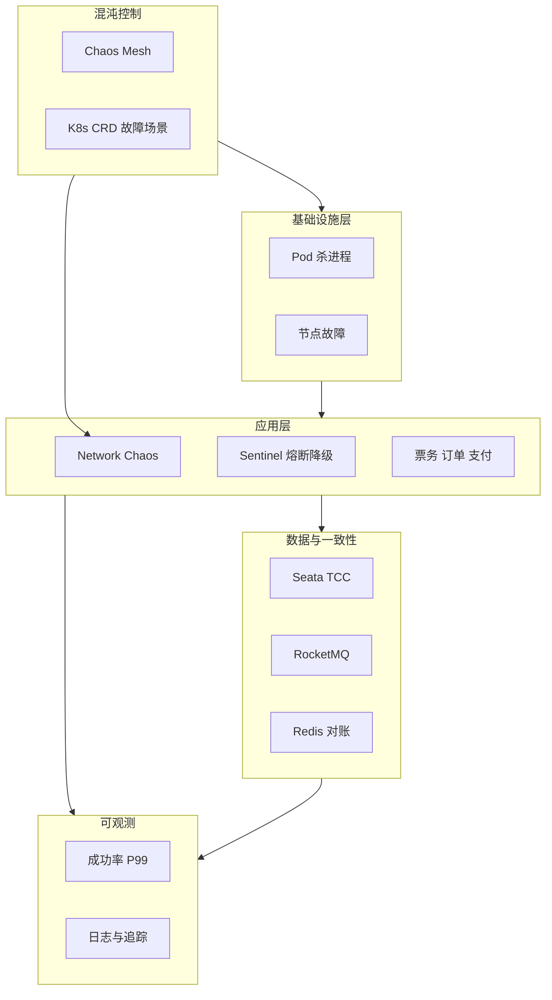

## 1.摘要（字数要求严格限制300字）
2024年3月，我参与某航空公司运营智能管理平台建设，项目面向航空运营机构、机场、旅客等用户，提供航空信息管理、旅客全流程服务、票务交易、航空检修预警、数据智能分析等核心业务功能。项目中，我担任系统架构师，全面负责平台架构设计与核心技术落地。本文围绕混沌工程在航空运营平台韧性验证中的应用展开论述，通过构建基于 Chaos Mesh 的云原生混沌工程平台实现基础设施层故障注入与自愈验证，基于应用层网络故障注入验证票务-订单-支付链路的熔断与降级，结合“红蓝对抗”式数据一致性演练保障资金与交易对账零差错。系统于2025年8月正式上线，截至2026年5月已稳定运行10个月，各项功能及性能指标均达到预设标准，获得客户高度认可。

## 2.项目背景（字数要求严格限制500字左右）
随着国家智慧民航建设战略深入推进，航空运输行业数字化、智能化转型迫在眉睫，《智慧民航建设路线图》等政策明确要求推动航空运营全流程数字化、智能化升级。在此背景下，某航空公司于2024年5月启动航空运营智能管理平台建设，旨在构建覆盖全部航线网络、近百个运营基地及数千万常旅客会员的数字化管理平台，实现航线、航班、票务等核心业务全流程智能管控，年服务旅客超3000万人次，为其提供全场景便捷服务，提升运营效率与服务体验。

我司中标后，我以系统架构师身份负责平台整体架构设计与核心技术落地。平台采用云原生架构部署于 Kubernetes，面临高并发、大数据量、分布式事务一致性、服务网格与网络不稳定等挑战，须在“安全第一、红线底线”前提下主动验证系统在故障下的表现与自愈能力。因此我们引入混沌工程，通过可控的故障注入在预发与生产隔离环境中发现薄弱环节并验证弹性与数据一致性，确保生产环境稳定性与资金安全。

为此，我们团队决定系统化开展混沌工程建设，从基础设施层故障注入与自愈验证、应用层网络故障注入与链路韧性验证、以及“红蓝对抗”式数据一致性演练三方面构建“可假设、可注入、可观测、最小爆炸半径”的混沌工程体系。平台于2025年8月正式上线，成功应对多轮节假日高并发压力，高效完成年度航班调度、设备检修预警及海量数据处理任务，为旅客提供全流程服务与7*24小时信息支持，上线一年稳定运行，各项指标达标，获得客户与用户一致认可。

## 3. 问题2回应+过度（字数要求严格限制400字）
由于本项目在 Kubernetes 与微服务架构下依赖众多组件与网络，若仅依赖常规测试无法验证节点宕机、网络延迟与丢包、消息队列异常等真实故障下的自愈与降级能力；同时资金与交易数据的一致性必须在故障场景下经过演练才能确保对账零差错。因此我们采用混沌工程作为韧性验证手段，其核心包括：第一，建立精确假设与稳态基线（如 QPS、延迟、错误率），在基础设施层通过 Chaos Mesh 进行 Pod 杀进程、节点故障等注入，验证云原生平台自愈能力并控制爆炸半径；第二，在应用层进行网络故障注入（延迟、丢包、分区），结合 Sentinel 熔断与降级验证票务-订单-支付链路的韧性；第三，在业务高峰（如 5500 TPS）下开展“红蓝对抗”式数据一致性演练，注入中间件与 Pod 故障，结合 Seata TCC 与 RocketMQ 最终一致性及对账机制，确保资金与交易数据零差错。

在本项目的实施中，我们通过 Chaos Mesh 基础设施层故障注入、应用层网络故障注入与链路韧性验证、以及红蓝对抗式数据一致性演练三大实践，完成了混沌工程在航空运营智能管理平台中的建设与落地，具体如下。

## 4. 正文部分三段论

### 正文三论点总览表

| 论点 | 要解决的问题 | 方案 / 技术栈 | 核心成效 |
|------|--------------|----------------|----------|
| **论点一：基于 Chaos Mesh 的基础设施层故障注入与自愈验证** | 集群与中间件在节点/Pod 故障下是否真正自愈不可知 | Chaos Mesh（Pod Chaos 等）通过 K8s CRD 定义并执行故障场景；监控 HTTP 成功率与 P99 延迟；杀 TiDB/Redis 等 Pod 验证自愈 | 自愈能力得到验证，发现并优化 ES 等配置问题，稳态指标可控 |
| **论点二：应用层网络故障注入与链路韧性验证** | 外部依赖与网络异常时核心业务是否可用未知 | Network Chaos 模拟延迟 3s、丢包 30%；Sentinel 超时与降级；模拟 MQ 阻塞与消费失败 | 发现韧性薄弱点并优化，核心业务在外部故障下仍可降级可用 |
| **论点三：红蓝对抗式数据一致性演练** | 故障下资金与交易对账是否零差错未验证 | 在高峰 5500 TPS 下注入 Pod/中间件故障；Seata TCC + RocketMQ 最终一致 + 对账；MQ Broker IO Chaos、Redis 全局表 | 发现并修复对账与一致性问题，实现资金与交易数据零差错目标 |

## 基于 Chaos Mesh 的基础设施层故障注入与自愈验证（字数要求严格限制在500-510字左右）
航空运营平台在 Kubernetes 上部署票务、旅客、航班、检修与数据服务等微服务，并依赖数据库、缓存与消息队列等中间件，若未在可控环境下验证节点或 Pod 故障时的自愈能力，生产一旦出现单点或局部故障，可能引发级联失效。为此，我们构建了基于 CNCF Chaos Mesh 的云原生混沌工程平台，在基础设施层开展故障注入与自愈验证。实施上，通过 Kubernetes CRD 与 YAML 定义故障场景（如 Pod Chaos：随机杀死指定命名空间内的 TiDB 节点 Pod 或 Redis 集群 Pod），在预发或隔离环境中激活实验；同时建立稳态假设与观测指标，如 HTTP 成功率>99.9%、API 响应时间 P99<500ms，在注入期间持续采集指标，若稳态被破坏则说明存在薄弱环节。通过多轮 Pod 杀进程实验，我们验证了平台在数据库与缓存节点故障后的自愈与故障转移能力，并发现并优化了 Elasticsearch 集群分区配置不当等问题，保障了热点节点的可靠性。实验严格遵循“最小爆炸半径”原则，仅在指定命名空间与副本范围内注入，避免对生产或全集群造成影响，混沌工程在基础设施层为航空运营平台的稳定性提供了可重复、可观测的验证手段。

## 应用层网络故障注入与链路韧性验证（字数要求严格限制在500-510字左右）
平台依赖支付网关、外部数据服务等多类外部依赖，网络延迟或丢包会导致核心业务超时或失败，若未验证熔断与降级策略，故障可能沿调用链扩散。为此，我们在应用层实施网络故障注入并验证链路韧性。技术上，在测试环境使用 Chaos Mesh 的 Network Chaos 能力，对关键接口（如旅客管理与票务系统之间、票务与支付之间）模拟“网络高延迟”（如 3 秒）与“丢包”（如 30%），观察核心业务是否仍能通过超时与降级保持可用。同时引入 Sentinel 等流控中间件，配置 1 秒超时与超时率超过 50% 时的降级策略（如返回缓存或友好提示），确保在依赖不可用时不发生雪崩。此外，模拟 RocketMQ 消息队列阻塞与消费失败，验证异步处理与补偿机制是否按预期工作。通过上述实验，我们发现了部分下游数据服务超时配置不当等韧性薄弱点，并完成优化；核心业务在外部网络故障下能够通过熔断与降级保持可用，混沌工程在应用层验证了“票务-订单-支付”链路的韧性机制，为智慧民航平台在高并发与异常网络下的稳定运行提供了保障。

## 红蓝对抗式数据一致性演练（字数要求严格限制在500-510字左右）
平台涉及票务收入、退改签与资金结算等资金与交易数据，在故障注入场景下必须保证数据一致性与对账准确，零容忍数据丢失或错账。为此，我们开展了“红蓝对抗”形式的数据一致性演练。场景上，在业务高峰（如模拟 5500 TPS）下注入故障：杀死参与分布式事务的 Pod、模拟 MQ Broker IO 异常等，观察 Seata TCC 与 RocketMQ 最终一致性及对账流程是否仍能保证账实一致。架构上，将 Chaos Mesh 与 Seata Server 等组件在隔离环境中部署，避免混沌实验影响生产账务；通过 Redis 全局表等机制辅助一致性校验与对账。多轮演练中，我们发现了“对账数据缺失”等违反 ACID 或最终一致性预期的异常，经排查与优化（如补偿任务、对账重试与幂等设计）后，资金与交易数据在故障场景下仍能实现准确对账，达到“零差错”数据管理目标。红蓝对抗式数据一致性演练将混沌工程与分布式事务、对账机制紧密结合，为航空运营平台的资金安全与合规提供了可验证、可复现的保障手段。

## 5. 论文总结（字数要求严格限制450字以内）
本平台响应智慧民航建设政策，以混沌工程（基础设施层故障注入与自愈、应用层网络故障与链路韧性、红蓝对抗式数据一致性演练）为核心，构建航空运营全流程一体化管理体系，2025年8月上线后稳定运行一年，超额达成预期目标。上线以来，系统日均处理票务交易超12万笔，核心业务响应时间≤800毫秒，运营效率提升35%，旅客投诉率下降40%，设备故障预警准确率92%，系统可用性达99.993%，峰值处理能力突破5500 TPS，成功应对节假日高并发压力，获行业与旅客广泛认可。混沌工程有效提升了运行期稳定性与抗峰能力，服务可用性达 99.99%，平均恢复时间（MTTR）控制在 5 分钟以内。项目复盘发现，可观测性与故障场景自动化仍有提升空间。后续将加强数据持久化与分布式追踪（如 TraceViewer、Elasticsearch 日志），自动化故障场景编排与生命周期管理，并探索 AI 与 TDD、混沌工程结合，实现 AI 辅助智能运维，助力智慧民航高质量发展。

## 6. 系统架构图

**图 7-1** 航空运营智能管理平台·混沌工程体系架构图
