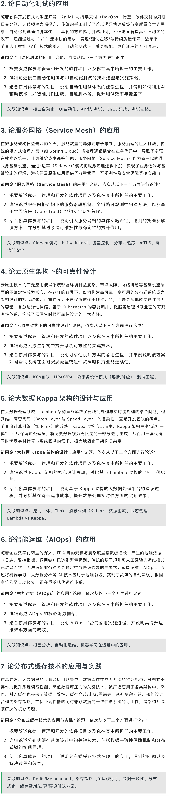

# 论文预测 · 总览

本目录为 **2026 论文预测** 素材站：同一套「航空运营智能管理平台」母案例，含原题、结构化论点、填空模板与完整成稿。**四个入口**与顶部导航一致，可从任意入口进入对应页面。

## 四个入口

| 入口 | 说明 | 链接 |
|:---|:---|:---|
| **预测题** | 预测主题与答题要求（含题图） | [预测题](./预测题) |
| **论题案例结构化论述** | 七主题、每主题三论点与母案例映射 | [结构化论述](./预测题_论题案例结构化论述) |
| **论文成稿·通用模板** | 摘要/背景/正文/总结占位符模板 | [通用模板](./论文成稿-通用模板) |
| **七篇完整成稿** | 按论题拆分的背诵成稿 | 见下方列表 |

## 题图

## 七篇成稿（论题 1–7）

| 论题 | 链接 |
|:---:|:---|
| 1 大模型及 AI Coding | [论题01](./论题01_大模型及AI_Coding技术应用_论文成稿) |
| 2 自动化测试 | [论题02](./论题02_自动化测试应用_论文成稿) |
| 3 服务网格 | [论题03](./论题03_服务网格应用_论文成稿) |
| 4 云原生可靠性 | [论题04](./论题04_云原生可靠性设计_论文成稿) |
| 5 Kappa 架构 | [论题05](./论题05_大数据Kappa架构设计应用_论文成稿) |
| 6 智能运维 AIOps | [论题06](./论题06_智能运维AIOps应用_论文成稿) |
| 7 分布式缓存 | [论题07](./论题07_分布式缓存技术应用实践_论文成稿) |

## 站点内返回

- [站点首页](/)
